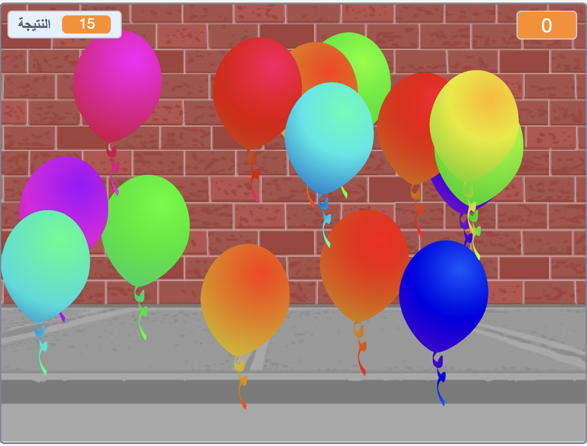

--- no-print ---

هذا هو إصدار **Scratch 3** من المشروع. هناك أيضاً [ إصدار Scratch 2 للمشروع](https://projects.raspberrypi.org/en/projects/balloons-scratch2).

--- /no-print ---

## المقدمة

سوف تقوم بصنع لعبة فرقعة البالون!

### ما الذي ستصنعه

--- no-print ---

فرقع البالونات عند النقر عليها.

  <iframe allowtransparency="true" width="485" height="402" src="https://scratch.mit.edu/projects/embed/394049690/?autostart=false" frameborder="0" scrolling="no"></iframe>
  

--- /no-print ---

--- print-only ---

--- /print-only ---

--- collapse ---
---
title: ما ستحتاج إليه
---

### الأجهزة

+ جهاز كمبيوتر يدعم تشغيل برنامج 3 Scratch

### البرامج

+ برنامج Scratch 3 (سواء أكان [عبر الإنترنت](http://rpf.io/scratchon){:target="_blank"} أو [دون اتصال بالإنترنت](http://rpf.io/scratchoff){:target="_blank"})

--- /collapse ---

--- collapse ---
---
title: ما الذي ستتعلمه
---

- كيفية استخدام الرسوم المتحركة لجعل الكائنات تتحرك
- كيفية استخدام الأرقام العشوائية
- كيفية رسم الكائنات
- كيفية إنشاء نُسخ من الكائن

--- /collapse ---

--- collapse ---
---
title: معلومات إضافية للمعلمين
---

--- no-print ---

إذا كنت بحاجة إلى طباعة هذا المشروع، فالرجاء استخدام [نسخة متوافقة مع الطابعة](https://projects.raspberrypi.org/ar-SA/projects/balloons/print){:target="_blank"}.

--- /no-print ---

يمكنك الحصول على [المشروع كاملاً من هنا](http://rpf.io/p/ar-SA/balloons-get){:target="_blank"}.

--- /collapse ---
