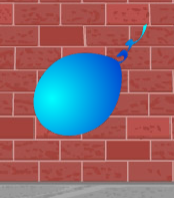
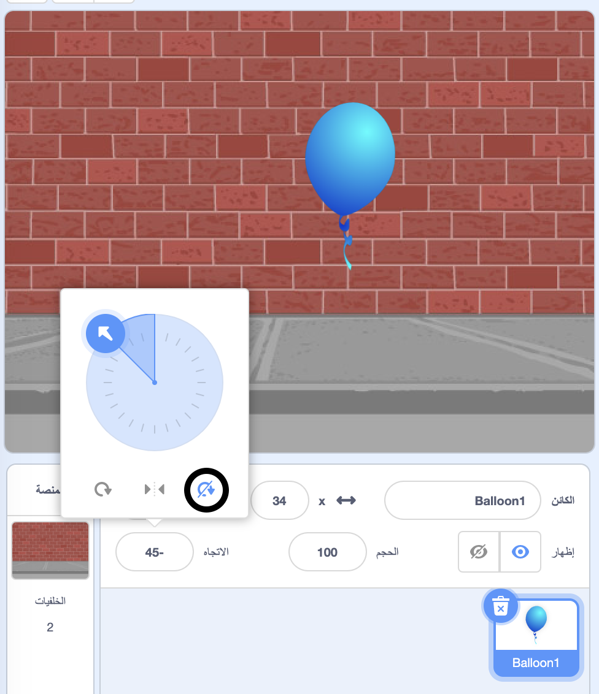

## تحريك البالون

--- task ---

افتح مشروع جديد في Scratch.

**متصل بالانترنت**: افتح [مشروع البداية في سكراتش](http://rpf.io/scratch-new){:target="_blank"}.

اذا كنت تملك حساب على برنامج Scratch فيمكنك عمل نسخة بالضغط على **Remix**.

**دون اتصال بالانترنت**: افتح مشروع جديد في Scratch عبر المحرر الموجود على جهازك دون اتصال بالانترنت.

اذا كنت تحتاج تنزيل و تنصيب محرر Scratch للعمل دون اتصال بالانترنت, فيمكنك ايجاده على الرابط [rpf.io/scratchoff](http://rpf.io/scratchoff){:target="_blank"}.

--- /task ---

--- task ---

احذف كائن القط.

--- /task ---

--- task ---

أضف كائن بالون جديد وخلفية مناسبة للمنصة.


--- /task ---


--- task ---

أضف هذا الكود إلى بالونك، بحيث يرتد حول الشاشة:


```blocks3
    when flag clicked
    go to x:(0) y:(0)
    point in direction (45 v)
    forever
        move (1) steps
        if on edge, bounce
    end
```

--- /task ---

--- task ---

اختبر بالونك. هل يتحرك ببطء شديد؟ قم بتغيير الأرقام في التعليمات البرمجية الخاصة بك إذا كنت تريد تسريعها قليلاً.

--- /task ---

--- task ---

هل لاحظت أيضًا أن بالونك يتقلب أثناء حركته حول الشاشة؟



البالونات لا تتحرك هكذا! لإصلاح ذلك ، انقر فوق كائن البالون، ثم انقر فوق الاتجاه.

قم بالضغط على "الاتجاه"، وانقر فوق "لا استدارة" لإيقاف تدوير البالون.



--- /task ---

--- task ---

اختبر البرنامج مرة أخرى لمعرفة ما إذا تم إصلاح المشكلة.

--- /task ---
