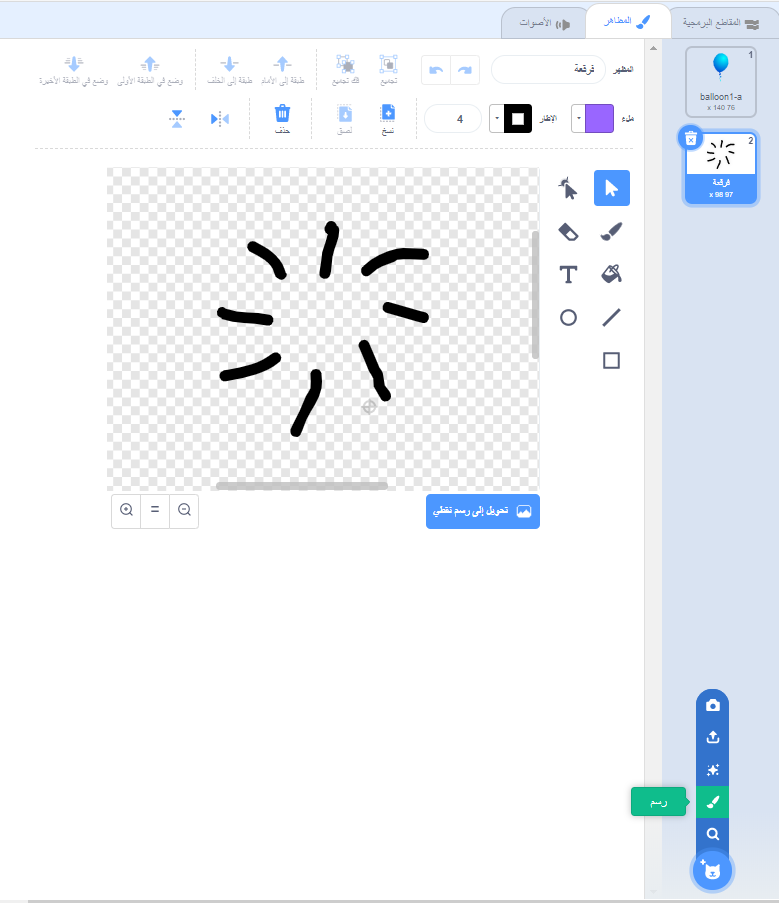

## فرقعة البالونات

دعونا نتيح للاعب أن يفرقع البالونات!

--- task ---

انقر فوق كائن البالون، ثم انقر فوق علامة التبويب **المظاهر**. يمكنك حذف جميع المظاهر الأخرى، وترك مظهر بالون واحد. قم بإضافة مظهر جديد، بالنقر فوق **رسم - اختيار مظهر** وإنشاء مظهر جديد يسمى ` فرقعة`.



--- /task ---

--- task ---

تأكد من أن بالونك يتحول إلى الزي الصحيح عند بدء اللعبة. يجب أن تبدو التعليماتك البرمجية على الشكل التالي:


```blocks3
when flag clicked
+switch costume to (بالون١-أ v)
point in direction (pick random (-90) to (180))
go to x:(pick random (-150) to (150)) y:(pick random (-150) to (150))
change [color v] effect by (pick random (0) to (200))
forever
    move (1) steps
    if on edge, bounce
end
```

--- /task ---

--- task ---

للسماح للاعب بفرقعة البالون، أضف هذا الكود:


```blocks3
    when this sprite clicked
    switch costume to (فرقعة v)
    start sound (pop v)
```

--- /task ---

--- task ---

قم بإختبار مشروعك. هل يمكنك تفجير البالون؟ هل تعمل كما توقعت؟

ستحتاج إلى تحسين هذا الكود، بحيث عند النقر على البالون، فإن مظهر` فرقعة `يعرض لوقت قصير، ثم يختفي.

يمكنك عمل كل هذا عن طريق تغيير كود بالونك `عند نقر هذا الكائن` لهذا:


```blocks3
when this sprite clicked
switch costume to (فرقعة v)
start sound (pop v)
+ wait (0.3) seconds
+ hide
```

--- /task ---

--- task ---

الآن انت تحذف البالون عند النقر عليه، ستحتاج أيضًا إلى إضافة كتلة `اظهر`{:class="block3looks"} في بداية كود` عند النقر على العلم`{:class="block3events"}.


```blocks3
when flag clicked
+ show
switch costume to (بالون١-أ v)
point in direction (pick random (-90) to (180))
```

--- /task ---

--- task ---

حاول فرقعة بالون مرة أخرى للتأكد من أنه يعمل بشكل صحيح.

--- /task ---
