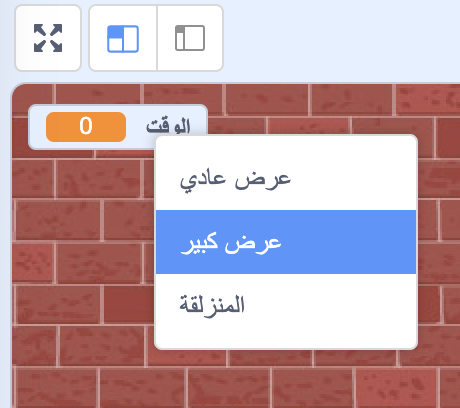

## إضافة مؤقت

يمكنك جعل لعبتك أكثر إثارة للاهتمام، من خلال منح لاعبك 10 ثوان فقط لتفجير أكبر عدد ممكن من البالونات.

--- task ---

يمكنك استخدام متغير آخر لتخزين الوقت المتبقي. انقر على المنصةـ وقم بانشاء متغير جديد بالاسم `الوقت `{:class="block3variables"}.

--- /task ---

هذه هي الطريقة التي يجب أن يعمل بها المؤقت:

+ يجب أن يبدأ المؤقت بـ 10 ثوانٍ;
+ يجب أن يقوم المؤقت بالعد التنازلي كل ثانية؛
+ ستنتهي اللعبة عندما يصل الموقِت إلى 0.

--- task ---

إليك الكود للقيام بذلك، والذي يمكنك إضافته إلى _ المنصة _ الخاصة بك:


```blocks3
when flag clicked
set [الوقت v] to [10]
repeat until <(الوقت) = [0]>
    wait (1) seconds
    change [الوقت v] by (-1)
end
stop [all v]
```

--- /task ---

--- task ---

اسحب متغير "الوقت" الخاص بك إلى الجانب الأيمن من المنصة. يمكنك أيضًا النقر بزر الماوس الأيمن على شاشة العرض المتغيرة واختيار "عرض كبير" لتغيير طريقة عرض الوقت.



--- /task ---

--- task ---

قم بإختبار لعبتك. كم نقطة ممكن أن تسجل؟ إذا كانت اللعبة سهلة للغاية، فيمكنك:

+ منح اللاعب وقتاً أقل;
+ الحصول على المزيد من البالونات;
+ جعل البالونات تتحرك بشكل أسرع ؛
+ جعل البالونات أصغر.

العب لعبتك عدة مرات حتى تشعر بالرضا عن المستوى الصحيح من الصعوبة.

--- /task ---

