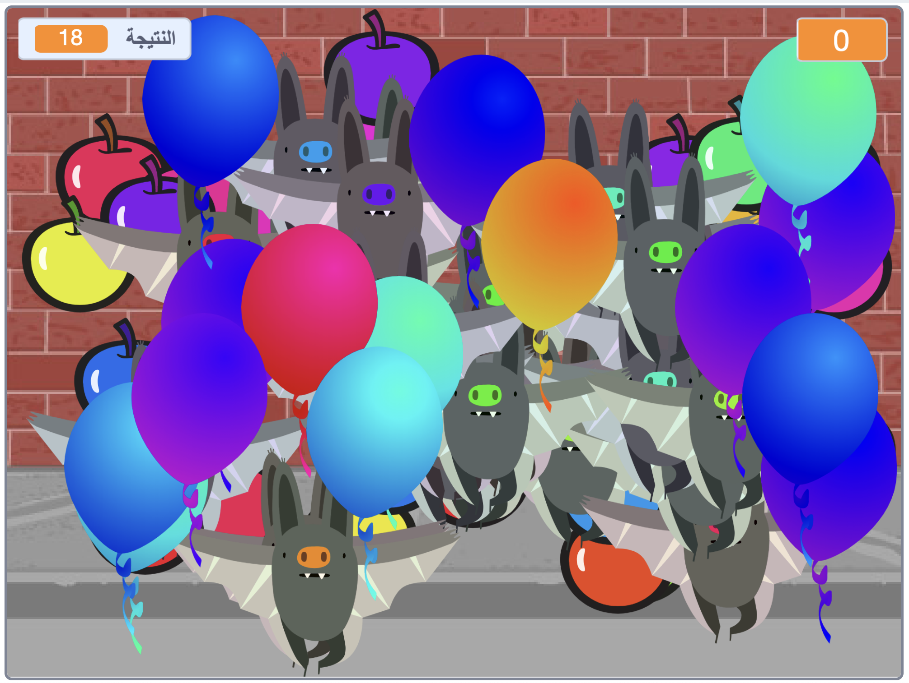

## التحدي: كائنات أخرى
هل يمكنك القيام بإضافة كائنات أخرى إلى اللعبة؟ يمكنك إضافة أشياء جيدة، مثل الكعك، التي تمنح اللاعب الكثير من النقاط، أو أشياء سيئة، مثل الخفافيش، تأخذ منك النقاط.

ستحتاج إلى التفكير في الأشياء التي تضيفها. فكر في:

+ كم عددها هناك؟
+ ما حجمه؟ كيف تتحرك؟
+ كم عدد النقاط التي سيحرزها اللاعب (أو يخسرها) عندما يحاول النقر عليها؟
+ هل ستتحرك أسرع أو أبطأ من البالونات؟
+ كيف سيكون مظهره/صوته إذا تم النقر عليه؟

إذا كنتَ تحتاج إلى مساعدة لإضافة كائن آخر، فيمكنك استخدام الخطوات السابقة!

