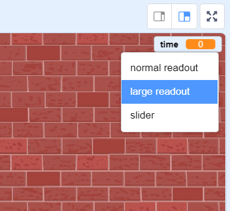

## Adding a timer

You can make your game more interesting, by only giving your player 10 seconds to pop as many balloons as possible.

--- task ---

You can use another variable to store the remaining time left. Click on the stage, and create a new variable called `time`{:class="block3variables"}.

--- /task ---

This is how the timer should work:

+ The timer should start at 10 seconds;
+ The timer should count down every second;
+ The game should stop when the timer gets to 0.

--- task ---

Here's the code to do this, which you can add to your _stage_:


```blocks3
when flag clicked
set [time v] to [10]
repeat until <(time) = [0]>
    wait (1) seconds
    change [time v] by (-1)
end
stop [all v]
```

--- /task ---

--- task ---

Drag your 'time' variable display to the right side of the stage. You can also right-click on the variable display and choose 'large readout' to change how the time is displayed.



--- /task ---

--- task ---

Test your game. How many points can you score? If your game is too easy, you can:

+ Give the player less time;
+ Have more balloons;
+ Make the balloons move faster;
+ Make the balloons smaller.

Play your game a few times until you're happy that it's the right level of difficulty.

--- /task ---

