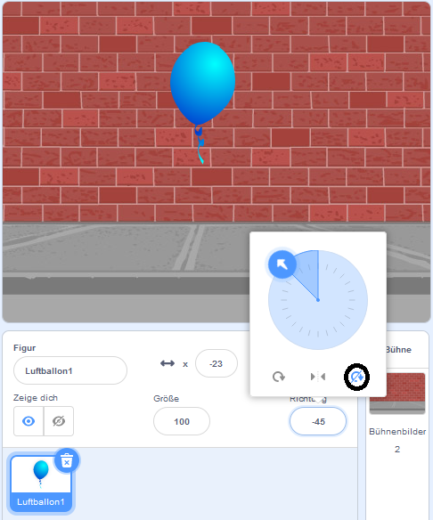

## Einen Luftballon animieren

--- task ---

Erstelle ein neues Scratch-Projekt.

**Online**: Öffne das [Starter-Projekt](http://rpf.io/scratch-new){:target="_blank"}.

Wenn du bereits einen Scratch-Account besitzt, kannst du dir durch Klick auf **Remix** eine Kopie anlegen.

**Offline**: Öffne ein neues Projekt im Offline-Editor.

Wenn du den Scratch-Offline-Editor herunterladen und installieren möchtest, findest du diesen unter [rpf.io/scratchoff](http://rpf.io/scratchoff){:target="_blank"}.

--- /task ---

--- task ---

Lösche die Katzen-Figur.

--- /task ---

--- task ---

Füge eine neue Luftballon-Figur und einen passenden Bühnenhintergrund hinzu.


--- /task ---


--- task ---

Füge diesen Code deinem Luftballon hinzu, damit er über den Bildschirm springt:


```blocks3
    when flag clicked
    go to x:(0) y:(0)
    point in direction (45 v)
    forever
        move (1) steps
        if on edge, bounce
    end
```

--- /task ---

--- task ---

Teste deinen Luftballon. Bewegt er sich zu langsam? Ändere die Zahlen in deinem Code, wenn du ihn etwas beschleunigen möchtest.

--- /task ---

--- task ---

Hast du auch bemerkt, dass sich dein Luftballon dreht, wenn er sich über den Bildschirm bewegt?


Luftballons bewegen sich nicht so! Um dies zu beheben, klicke auf das Luftballon-Figur-Symbol und dann auf die Richtung.

Klicke im Abschnitt "Rotationsstil" auf "Nicht drehen", um die Rotation des Luftballons zu stoppen.



--- /task ---

--- task ---

Teste dein Programm erneut, um festzustellen, ob das Problem behoben ist.

--- /task ---
