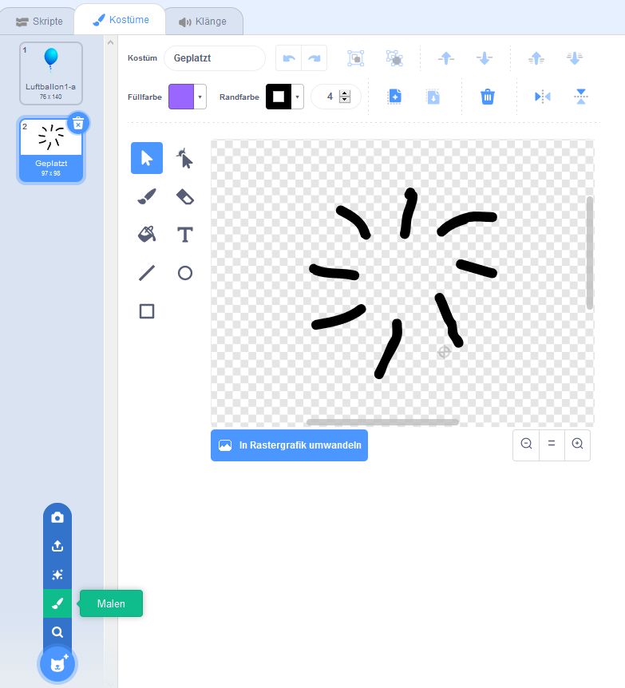

## Luftballons platzen lassen

Erlaube dem Spieler, die Luftballons platzen zu lassen!

--- task ---

Klicke auf deinen Luftballon-Sprite und klicke auf den Reiter **Kostüme**. Du kannst bis auf ein Luftballon-Kostüm alle Kostüme löschen. Füge ein neues Kostüm hinzu, indem du auf **Malen** klickst und ein neues Kostüm namens `Geplatzt` erstellst.



--- /task ---

--- task ---

Stelle sicher, dass dein Luftballon zu Beginn des Spiels auf das richtige Kostüm wechselt. Dein Code sollte jetzt so aussehen:


```blocks3
when flag clicked
+switch costume to (Luftballon1-a v)
point in direction (pick random (-90) to (180))
go to x:(pick random (-150) to (150)) y:(pick random (-150) to (150))
change [color v] effect by (pick random (0) to (200))
forever
    move (1) steps
    if on edge, bounce
end
```

--- /task ---

--- task ---

Füge diesen Code hinzu, damit der Spieler einen Luftballon platzen lassen kann:


```blocks3
    when this sprite clicked
    switch costume to (Geplatzt v)
    start sound (pop v)
```

--- /task ---

--- task ---

Teste nun dein Projekt. Kannst du den Luftballon platzen lassen? Funktioniert es wie erwartet?

Du musst diesen Code verbessern, damit beim Klicken auf den Luftballon das `Geplatzt` Kostüm für kurze Zeit angezeigt wird.

Du kannst dies alles erreichen, indem du deinem Luftballon `Wenn diese Figur angeklickt wird`{:class="block3events"} Code so änderst:


```blocks3
when this sprite clicked
switch costume to (Geplatzt v)
start sound (pop v)
+ wait (0.3) seconds
+ hide
```

--- /task ---

--- task ---

Wenn du den Luftballon beim Anklicken löschst, musst du auch einen `zeige dich`{:class="block3looks"} Block am Anfang des `Wenn die Fahne angeklickt wird`{:class="block3events"} Block hinzufügen.


```blocks3
when flag clicked
+ show
switch costume to (Luftballon1-a v)
point in direction (pick random (-90) to (180))
```

--- /task ---

--- task ---

Versuche erneut, einen Luftballon platzen zu lassen um zu überprüfen, ob er ordnungsgemäß funktioniert.

--- /task ---
