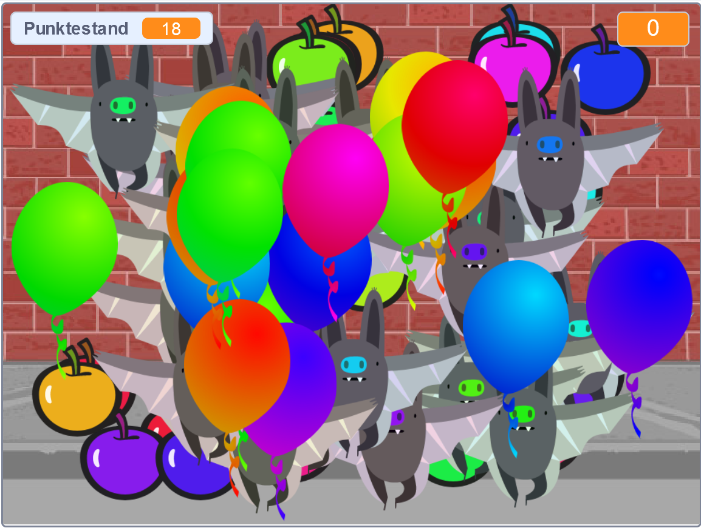

## Herausforderung: mehr Objekte
Kannst du deinem Spiel andere Objekte hinzufügen? Du kannst gute Objekte wie Donuts hinzufügen, die deinen Punktestand erhöhen oder schlechte Objekte wie Fledermäuse, die deinen Punktestand reduzieren.

Du musst über die Objekte nachdenken, die du hinzufügst. Überlege dir:

+ Wie viele gibt es?
+ Wie groß sind sie? Wie bewegen sie sich?
+ Wie viele Punkte erhält (oder verliert) der Spieler, wenn er sie anklickt?
+ Bewegen sie sich schneller oder langsamer als die Ballons?
+ Wie werden sie aussehen/ sich anhören, wenn sie angeklickt werden?

Wenn du Hilfe beim Hinzufügen eines weiteren Objekts benötigst, kannst du die vorher genannten Schritte erneut verwenden.

