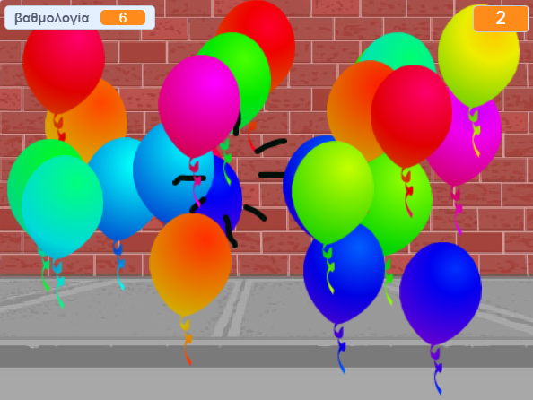

--- no-print ---

Αυτή είναι η έκδοση **Scratch 3** του έργου. Υπάρχει επίσης η [έκδοση Scratch 2 του έργου](https://projects.raspberrypi.org/el-GR/projects/balloons-scratch2).

--- /no-print ---

## Εισαγωγή

Θα φτιάξεις ένα παιχνίδι στο οποίο θα σκας μπαλόνια!

### Τι θα φτιάξεις

--- no-print ---

Σκάσε τα μπαλόνια κάνοντας κλικ σε αυτά.

  <iframe allowtransparency="true" width="485" height="402" src="https://scratch.mit.edu/projects/embed/394051411/?autostart=false" frameborder="0" scrolling="no"></iframe>
  

--- /no-print ---

--- print-only ---

--- /print-only ---

--- collapse ---
---
title: Τι θα χρειαστείς
---

### Υλικό

+ Ένας υπολογιστής ικανός να τρέχει το Scratch

### Λογισμικό

+ Scratch 3 (είτε [online](https://rpf.io/scratchon){:target="_blank"} είτε [offline](https://rpf.io/scratchoff){:target="_blank"})

--- /collapse ---

--- collapse ---
---
title: Τι θα μάθεις
---

- Πώς να δημιουργήσεις κινούμενα σχέδια με τα αντικείμενα στο scratch
- Πώς να χρησιμοποιήσεις τυχαίους αριθμούς
- Πώς να ζωγραφίσεις αντικείμενα
- Πώς να δημιουργήσεις κλώνο ενός αντικειμένου

--- /collapse ---

--- collapse ---
---
title: Πρόσθετες πληροφορίες για εκπαιδευτικούς
---

--- no-print ---

Αν χρειαστεί να εκτυπώσεις αυτό το έργο, χρησιμοποίησε την [εκτυπώσιμη έκδοση](https://projects.raspberrypi.org/el-GR/projects/balloons/print)"{:target="_blank"}.

--- /no-print ---

Μπορείς να βρεις [το ολοκληρωμένο έργο εδώ](https://rpf.io/p/el-GR/balloons-get){:target="_blank"}.

--- /collapse ---
