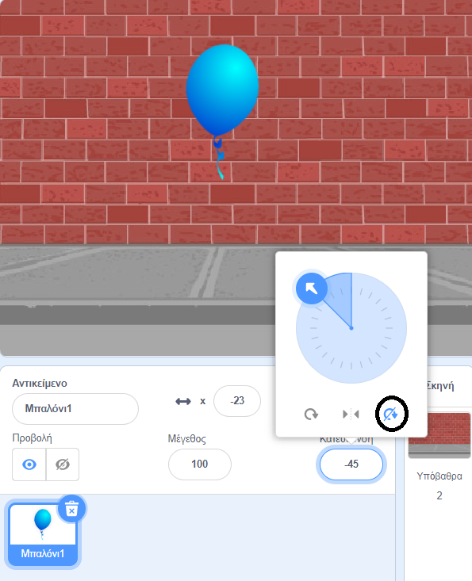

## Δίνοντας κίνηση στο μπαλόνι

--- task ---

Δημιούργησε ένα νέο έργο Scratch.

**Online**: άνοιξε ένα [νέο online έργο Scratch](http://rpf.io/scratch-new){:target="_ blank"}.

Αν έχεις λογαριασμό Scratch μπορείς να κάνεις ένα αντίγραφο, κάνοντας κλικ στο κουμπί **Ανάμειξη**.

**Eκτός σύνδεσης**: άνοιξε ένα νέο έργο στο Scratch.

Αν χρειαστεί να κατεβάσεις και να εγκαταστήσεις τον offline editor για το Scratch, μπορείς να το βρεις στο [rpf.io/scratchoff](http://rpf.io/scratchoff){:target="_blank"}.

--- /task ---

--- task ---

Διέγραψε το αντικείμενο γάτα.

--- /task ---

--- task ---

Πρόσθεσε ένα νέο αντικείμενο μπαλόνι και ένα κατάλληλο υπόβαθρο σκηνικού.


--- /task ---


--- task ---

Πρόσθεσε αυτόν τον κώδικα στο μπαλόνι σου, έτσι ώστε να αναπηδά τριγύρω στην οθόνη:


```blocks3
    when flag clicked
    go to x:(0) y:(0)
    point in direction (45 v)
    forever
        move (1) steps
        if on edge, bounce
    end
```

--- /task ---

--- task ---

Δοκίμασε το μπαλόνι σου. Μήπως κινείται πολύ αργά; Άλλαξε τους αριθμούς στον κώδικά σου εάν θέλεις να το επιταχύνεις λίγο.

--- /task ---

--- task ---

Παρατήρησες επίσης ότι το μπαλόνι σου γυρίζει καθώς κινείται τριγύρω;


Τα μπαλόνια δεν κινούνται έτσι! Για να το διορθώσεις, κάνε κλικ στο εικονίδιο με το αντικείμενο μπαλόνι και, στη συνέχεια, κάνε κλικ στην κατεύθυνση.

Στην ενότητα «στυλ περιστροφής», κάνε κλικ στο «Χωρίς περιστροφή» για να σταματήσεις την περιστροφή του μπαλονιού.



--- /task ---

--- task ---

Δοκίμασε ξανά το πρόγραμμά σου για να δεις αν το πρόβλημα έχει επιλυθεί.

--- /task ---
