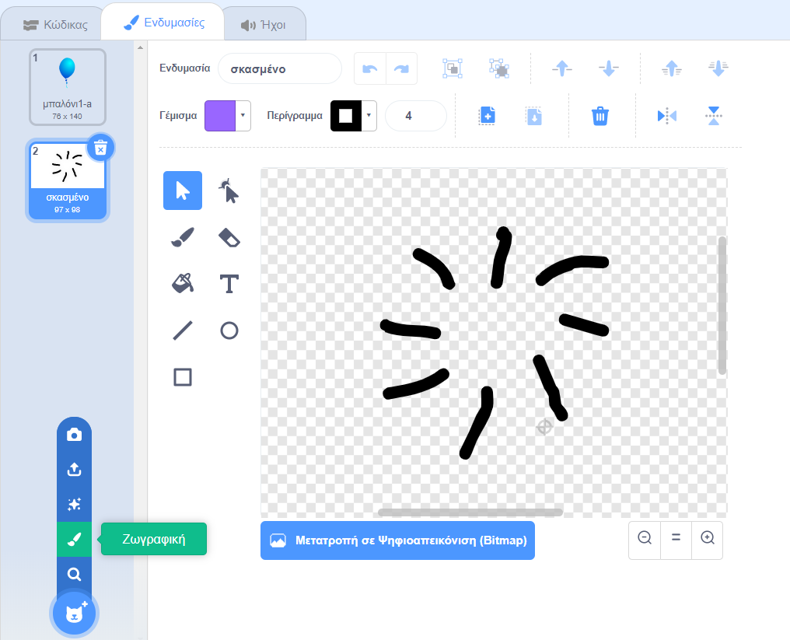

## Σκάσιμο μπαλονιών

Ας δώσουμε τη δυνατότητα στον παίκτη να σκάσει τα μπαλόνια!

--- task ---

Κάνε κλικ στο αντικείμενο μπαλόνι και ξανά κλικ στην καρτέλα **Ενδυμασίες**. Μπορείς να διαγράψεις όλες τις άλλες ενδυμασίες, αφήνοντας μόνο μία ενδυμασία με μπαλόνι. Πρόσθεσε μια νέα ενδυμασία, κάνοντας κλικ στη **Ζωγραφική νέας ενδυμασίας ** και δημιούργησε μία νέα ενδυμασία με το όνομα `σκασμένο`.



--- /task ---

--- task ---

Βεβαιώσου ότι το μπαλόνι σου αλλάζει στη σωστή ενδυμασία κατά την έναρξη του παιχνιδιού. Ο κώδικάς σου τώρα θα φαίνεται έτσι:


```blocks3
when flag clicked
+switch costume to (balloon1-a v)
point in direction (pick random (-90) to (180))
go to x:(pick random (-150) to (150)) y:(pick random (-150) to (150))
change [color v] effect by (pick random (0) to (200))
forever
    move (1) steps
    if on edge, bounce
end
```

--- /task ---

--- task ---

Για να δώσεις τη δυνατότητα στον παίκτη να σκάσει ένα μπαλόνι, πρόσθεσε αυτόν τον κώδικα:


```blocks3
    when this sprite clicked
    switch costume to (burst v)
    start sound (pop v)
```

--- /task ---

--- task ---

Δοκίμασε το έργο σου. Μπορείς να σκάσεις το μπαλόνι; Είναι αυτό που περίμενες;

Θα χρειαστεί να βελτιώσεις αυτόν τον κώδικα, έτσι ώστε όταν κάνεις κλικ στο μπαλόνι, να δείχνει την ενδυμασία `σκασμένο` για μικρό χρονικό διάστημα, και στη συνέχεια να εξαφανίζεται.

Μπορείς να τα κάνεις όλα αυτά αλλάζοντας τον κώδικα στο μπαλόνι σου στο ` όταν γίνει κλικ σε αυτό το αντικείμενο`{:class="block3events"}:


```blocks3
when this sprite clicked
switch costume to (burst v)
start sound (pop v)
+ wait (0.3) seconds
+ hide
```

--- /task ---

--- task ---

Τώρα που διαγράφεις το μπαλόνι όταν γίνει κλικ, θα πρέπει επίσης να προσθέσεις ένα μπλοκ `εμφανίσου`{:class="block3looks"} στην αρχή του κώδικα `όταν γίνει κλικ στην πράσινη σημαία`{:class="block3events"}.


```blocks3
when flag clicked
+ show
switch costume to (balloon1-a v)
point in direction (pick random (-90) to (180))
```

--- /task ---

--- task ---

Δοκίμασε να σκάσεις ξανά ένα μπαλόνι, για να βεβαιωθείς ότι λειτουργεί σωστά.

--- /task ---
