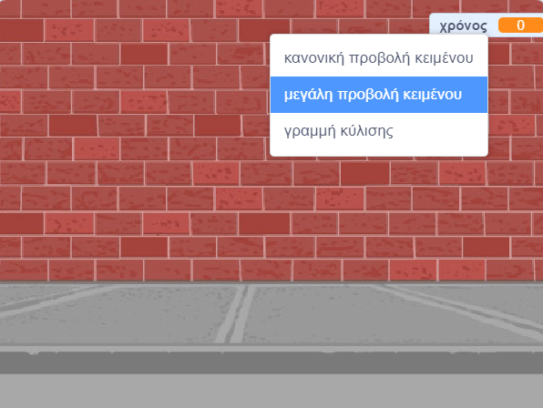

## Προσθήκη χρονόμετρου

Μπορείς να κάνεις το παιχνίδι σου πιο ενδιαφέρον, δίνοντας στον παίκτη σου μόνο 10 δευτερόλεπτα για να σκάσει όσο το δυνατόν περισσότερα μπαλόνια.

--- task ---

Μπορείς να χρησιμοποιήσεις μια άλλη μεταβλητή για να αποθηκεύσεις τον υπόλοιπο χρόνο που απομένει. Κάνε κλικ στο σκηνικό και δημιούργησε μία νέα μεταβλητή με το όνομα `χρόνος`{:class="block3variables"}.

--- /task ---

Έτσι θα δουλεύει το χρονόμετρο:

+ Το χρονόμετρο θα ξεκινάει στα 10 δευτερόλεπτα˙
+ Το χρονόμετρο θα μετράει αντίστροφα κάθε δευτερόλεπτο˙
+ Το παιχνίδι θα σταματάει όταν το χρονόμετρο φτάσει στο 0.

--- task ---

Εδώ είναι ο κώδικας για να το κάνεις αυτό, τον οποίο μπορείς να προσθέσεις στο _σκηνικό_:


```blocks3
when flag clicked
set [χρόνος v] to [10]
repeat until <(χρόνος) = [0]>
    wait (1) seconds
    change [χρόνος v] by (-1)
end
stop [all v]
```

--- /task ---

--- task ---

Σύρε την οθόνη μεταβλητής «χρόνου» στη δεξιά πλευρά του σκηνικού. Μπορείς επίσης να κάνεις δεξί κλικ στην οθόνη μεταβλητής και να επιλέξεις «μεγάλη προβολή κειμένου» για να αλλάξεις τον τρόπο εμφάνισης της ώρας.



--- /task ---

--- task ---

Δοκίμασε το παιχνίδι σου. Πόσους βαθμούς μπορείς να σκοράρεις; Αν το παιχνίδι σου είναι πολύ εύκολο, μπορείς να:

+ Δώσεις στον παίκτη λιγότερο χρόνο˙
+ Έχεις περισσότερο μπαλόνια˙
+ Κάνεις τα μπαλόνια να κινούνται γρηγορότερα˙
+ Κάνεις τα μπαλόνια μικρότερα.

Δοκίμασε το παιχνίδι σου μερικές φορές μέχρι να είσαι ικανοποιημένος με το επίπεδο δυσκολίας.

--- /task ---

