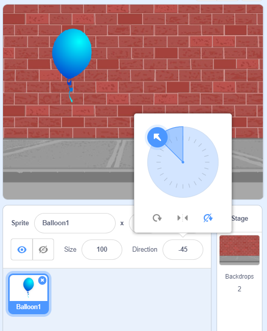

## Animating a balloon


+ Start a new Scratch project, and delete the cat sprite so that your project is empty. You can find the online Scratch editor at <a href="http://jumpto.cc/scratch-new" target="_blank">jumpto.cc/scratch-new</a>.

+ Add in a new balloon sprite, and a suitable stage backdrop.

	

+ Add this code to your balloon, so that it bounces around the screen:

	```blocks
		when flag clicked
		go to x:(0) y:(0)
		point in direction (45 v)
		forever
			move (1) steps
			if on edge, bounce
		end
	```

+ Test out your balloon. Does it move too slowly? Change the numbers in your code if you want to speed it up a bit.

+ Did you also notice that your balloon flips as it moves around the screen?

	

	Balloons don't move like this! To fix this, click on the balloon sprite icon, and then click the blue `i`{:class="blockmotion"} information icon.

	
	In the 'rotation style' section, click the dot to stop the balloon rotating.

	

+ Test your program again to see if the problem is fixed.


