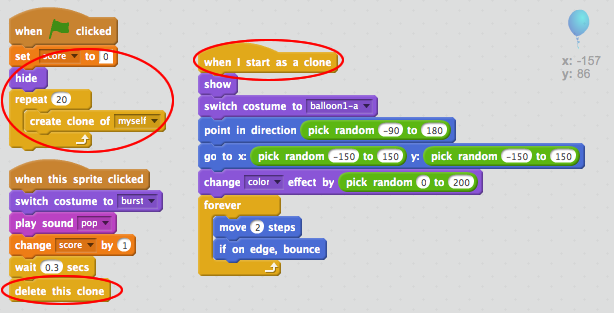

## Lots of balloons

Popping 1 balloon isn't much of a game, so let's add lots more!

One simple way to get lots of balloons is just to right-click on the balloon sprite and click 'duplicate'. This is OK if you only want a few, but what if you need 20? or 100? Are you really going to click 'duplicate' that many times?

+ A much better way of getting lots of balloons is to _clone_ the balloon sprite.

	Drag your balloon `when flag clicked`{:class="blockevents"} code (except the `score`{:class="blockdata"} block) off of the event (don't delete it), and instead add code to create 20 balloon clones.

	You can now attach the code you've just removed to the `when I start as a clone`{:class="blockevents"} event. You should also replace the `hide`{:class="blocklooks"} block in the balloon-clicking script with a `delete this clone`{:class="blockcontrol"} block.

	Your balloon code should now look like this:

	

+ Test your project! Now when the flag is clicked, your main balloon sprite will hide and then clone itself 20 times. When each of these 20 clones is started, they will each bounce around the screen randomly, just as they did before. See if you can pop the 20 balloons!

