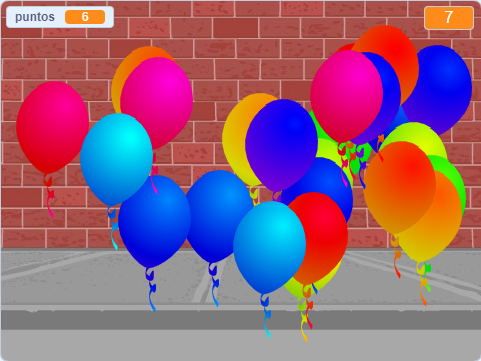

--- no-print ---

Esta es la versión **Scratch 3** del proyecto. También hay una [versión del proyecto en Scratch 2](https://projects.raspberrypi.org/es-ES/projects/balloons-scratch2).

--- /no-print ---

## Introducción

¡Vas a hacer un juego de reventar globos!

### Lo que harás

--- no-print ---

Explota los globos haciendo clic en ellos.

  <iframe allowtransparency="true" width="485" height="402" src="https://scratch.mit.edu/projects/embed/400244481/?autostart=false" frameborder="0" scrolling="no"></iframe>
  

--- /no-print ---

--- print-only ---

--- /print-only ---

--- collapse ---
---
title: Lo que necesitarás
---

### Hardware

+ Un ordenador capaz de ejecutar Scratch

### Software

+ Scratch 3 (ya sea [en línea](https://rpf.io/scratchon){:target="_blank"} o [sin conexión](https://rpf.io/scratchoff){:target="_blank"})

--- /collapse ---

--- collapse ---
---
title: Lo que vas a aprender
---

- Cómo usar la animación para hacer que los objetos se muevan
- Cómo usar números aleatorios
- Cómo dibujar objetos
- Cómo crear clones de un sprite

--- /collapse ---

--- collapse ---
---
title: Información adicional para educadores
---

--- no-print ---

Si necesitas imprimir este proyecto, por favor usa la [versión para imprimir](https://projects.raspberrypi.org/es-ES/projects/balloons/print){:target="_blank"}.

--- /no-print ---

Puedes [encontrar el proyecto completo aquí](https://rpf.io/p/es-ES/balloons-get){:target="_blank"}.

--- /collapse ---
