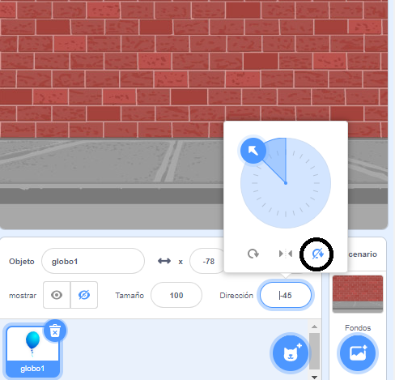

## Animando un globo

--- task ---

Abre un nuevo proyecto en Scratch.

**Online**: open a [new online Scratch project](http://rpf.io/scratch-new){:target="_blank"}.

Si tienes una cuenta de Scratch puedes hacer una copia haciendo clic en **Reinventar**.

**Sin conexión:** abre un nuevo proyecto en el editor sin conexión.

Si necesitas descargar e instalar el editor sin conexión de Scratch, puedes encontrarlo en [rpf.io/scratchoff](http://rpf.io/scratchoff){:target="_blank"}.

--- /task ---

--- task ---

Borra el objeto gato.

--- /task ---

--- task ---

Añade un nuevo objeto globo (balloon) y un fondo de escenario adecuado.


--- /task ---


--- task ---

Agrega este código a tu globo, para que rebote por la pantalla:


```blocks3
    when flag clicked
    go to x:(0) y:(0)
    point in direction (45 v)
    forever
        move (1) steps
        if on edge, bounce
    end
```

--- /task ---

--- task ---

Prueba tu globo. ¿Se mueve demasiado lento? Cambia los números en tu código si deseas acelerarlo un poco.

--- /task ---

--- task ---

Did you also notice that your balloon flips as it moves around the screen?


¡Los globos no se mueven así! Para solucionar esto, haz clic en el ícono del globo y luego haga clic en la dirección.

En la sección 'estilo de rotación', haga clic en 'No rotar' para evitar que el globo se de la vuelta.



--- /task ---

--- task ---

Test your program again to see if the problem is fixed.

--- /task ---
