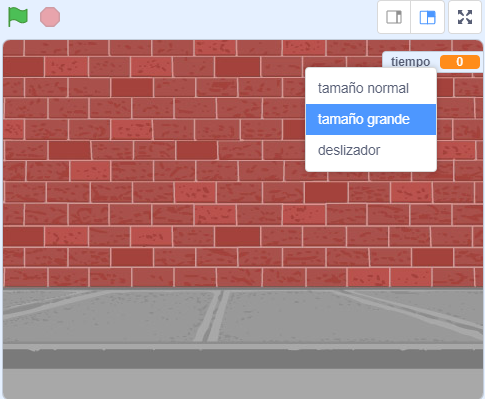

## Añadir un temporizador

Puedes hacer que tu juego sea más interesante, dando a tu jugador sólo 10 segundos para hacer estallar tantos globos como pueda.

--- task ---

Puedes usar otra variable para almacenar el tiempo restante. Haz clic en el escenario y crea una nueva variable llamada `tiempo`{:class="block3variables"}.

--- /task ---

Así es como debería funcionar el temporizador:

+ El temporizador debe comenzar con 10 segundos;
+ El temporizador debe contar hacia atrás cada segundo;
+ El juego debería detenerse cuando el temporizador llegue a 0.

--- task ---

Aquí está el código para hacer esto, que puedes agregar a tu _escenario_:


```blocks3
when flag clicked
set [time v] to [10]
repeat until <(time) = [0]>
    wait (1) seconds
    change [time v] by (-1)
end
stop [all v]
```

--- /task ---

--- task ---

Arrastra la variable "tiempo" al lado derecho del escenario. También puede hacer clic con el botón derecho en la variable y elegir 'tamaño grande' para cambiar la forma en que se muestra la hora.



--- /task ---

--- task ---

Prueba tu juego. ¿Cuántos puntos puedes anotar? Si tu juego es demasiado fácil, puedes:

+ Darle menos tiempo al jugador;
+ Tener más globos;
+ Hacer que los globos se muevan más rápido;
+ Hacer los globos más pequeños.

Juega tu juego varias veces hasta que estés contento con el nivel de dificultad.

--- /task ---

