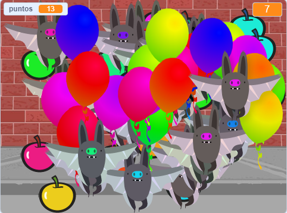

## Desafío: Más objetos
¿Puedes añadir otros objetos a tu juego? Puedes agregar objetos buenos, como donuts, que te dan muchos puntos, u objetos malos, como murciélagos, que te quitan puntos.

Tendrás que pensar en los objetos que estás agregando. Piensa en:

+ ¿Cuántos habrá?
+ ¿Cómo es de grande? ¿Cómo se mueven?
+ ¿Cuántos puntos obtendrás (o perderás) por hacer clic en ellos?
+ ¿Se moverán más rápido o más lento que los globos?
+ ¿Cómo se verán / sonarán cuando hagas clic en ellos?

Si necesitas ayuda para agregar otro objeto, ¡puede reutilizar los pasos anteriores!

