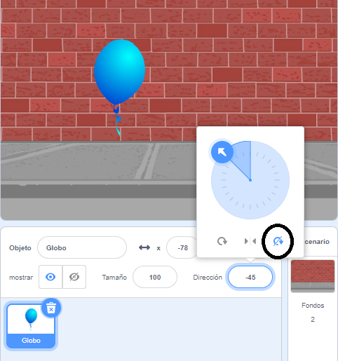

## Animando un globo

--- task ---

Abre un nuevo proyecto en Scratch.

** En línea ** abre un [ nuevo proyecto Scratch en línea ](http://rpf.io/scratch-new) {: target = "_ blank"}.

Si tienes una cuenta Scratch puedes hacer una copia haciendo clic en **Remix**.

**Sin conexión:** abre un nuevo proyecto en el editor sin conexión.

Si necesitas descargar e instalar el editor sin conexión de Scratch, puedes encontrarlo en [rpf.io/scratchoff](http://rpf.io/scratchoff){:target="_blank"}.

--- /task ---

--- task ---

Elimina el objeto de gato.

--- /task ---

--- task ---

Agrega un nuevo objeto de globo y un fondo de escenario adecuado.


--- /task ---


--- task ---

Agrega este código a tu globo, para que rebote alrededor de la pantalla:


```blocks3
    when flag clicked
    go to x:(0) y:(0)
    point in direction (45 v)
    forever
        move (1) steps
        if on edge, bounce
    end
```

--- /task ---

--- task ---

Prueba tu animación del globo. ¿Se mueve demasiado lento? Cambia los números en tu código si quieres acelerarlo un poco.

--- /task ---

--- task ---

¿Notaste que tu globo también se voltea cuando se mueve por la pantalla?


¡Los globos no se mueven así! Para solucionar esto, haz clic en el ícono del globo y luego haz clic en la dirección.

En la sección 'estilo de rotación', haz clic en 'No rotar' para detener la rotación del globo.



--- /task ---

--- task ---

Prueba tu programa nuevamente para ver si el problema se solucionó.

--- /task ---
