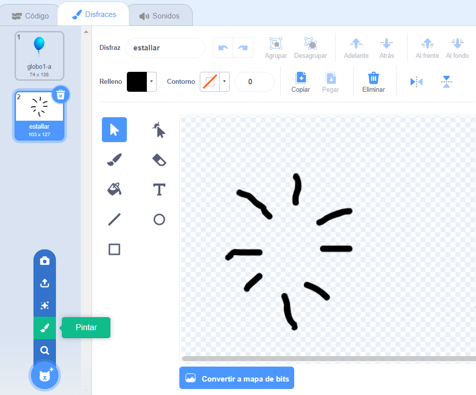

## Reventando globos

¡Dejemos que el jugador reviente los globos!

--- task ---

Haz clic en tu objeto globo y luego haz clic en la pestaña **Disfraces**. Puedes eliminar todos los otros disfraces, dejando solo 1 disfraz de globo. Agrega un nuevo disfraz, haciendo clic en **Pintar disfraz nuevo** y crea un nuevo disfraz llamado `estallar`.



--- /task ---

--- task ---

Asegúrate de que tu globo cambie al disfraz correcto cuando comience el juego. Tu código debería verse así:


```blocks3
when flag clicked
+switch costume to (globo1-a v)
point in direction (pick random (-90) to (180))
go to x:(pick random (-150) to (150)) y:(pick random (-150) to (150))
change [color v] effect by (pick random (0) to (200))
forever
    move (1) steps
    if on edge, bounce
end
```

--- /task ---

--- task ---

Para permitir que el jugador explote un globo, agrega este código:


```blocks3
    when this sprite clicked
    switch costume to (estallar v)
    start sound (pop v)
```

--- /task ---

--- task ---

Prueba tu proyecto. ¿Puedes reventar el globo? ¿Funciona como esperabas?

Deberás mejorar este código, para que cuando se haga clic en el globo, muestre el disfraz `explosión` tiempo corto, y luego se oculta.

Puedes hacer que todo esto suceda cambiando su globo `cuando se hace clic en el objeto`{:class="block3events"} código para esto:


```blocks3
when this sprite clicked
switch costume to (estallar v)
start sound (pop v)
+ wait (0.3) seconds
+ hide
```

--- /task ---

--- task ---

Ahora que estás eliminando el globo cuando se hace clic, también necesitarás agregar un bloque `mostrar`{:class="block3looks"} al comienzo del `cuando se hace clic en la bandera`{:class="block3events"} código.


```blocks3
when flag clicked
+ show
switch costume to (globo1-a v)
point in direction (pick random (-90) to (180))
```

--- /task ---

--- task ---

Intenta hacer estallar un globo nuevamente para verificar que funcione correctamente.

--- /task ---
