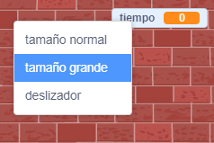

## Añadir un cronómetro

Puedes hacer que tu juego sea más interesante, solo dando a tu jugador 10 segundos para hacer estallar tantos globos como sea posible.

--- task ---

Puedes usar otra variable para almacenar el tiempo restante. Haz clic en el escenario y crea una nueva variable llamada `tiempo` {: class = "block3variables"}.

--- /task ---

Así es como debería funcionar el cronómetro:

+ El temporizador debería comenzar en 10 segundos;
+ El cronómetro debería contar hacia atrás cada segundo;
+ El juego debería detenerse cuando el temporizador llegue a 0.

--- task ---

Aquí está el código para hacer esto, que puede agregar a tu_escenario_:


```blocks3
when flag clicked
set [time v] to [10]
repeat until <(time) = [0]>
    wait (1) seconds
    change [time v] by (-1)
end
stop [all v]
```

--- /task ---

--- task ---

Arrastra tu pantalla de la variable "tiempo" al lado derecho del escenario. También puedes hacer clic con el botón derecho en la pantalla variable y elegir 'lectura grande' para cambiar la forma en que se muestra el tiempo.



--- /task ---

--- task ---

Prueba tu juego. ¿Cuántos puntos puedes anotar? Si tu juego es demasiado fácil, puedes:

+ Dale al jugador menos tiempo;
+ Tener más globos;
+ Haz que los globos se muevan más rápido;
+ Haz los globos más pequeños.

Prueba tu juego varias veces hasta que estés seguro de que tiene el nivel de dificultad adecuado.

--- /task ---

