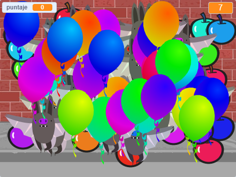

## Desafío: más objetos
¿Puedes añadir otros objetos a tu juego? Puedes agregar objetos buenos, como donas, que te dan muchos puntos, u objetos malos, como murciélagos, que te quitan puntos.

Tendrás que pensar en los objetos que estás agregando. Piensa en:

+ ¿Cuántos habrá?
+ ¿Qué tan grande es? ¿Cómo se mueve?
+ ¿Cuántos puntos obtendrás (o perderás) por hacer clic en él?
+ ¿Se moverá más rápido o más lento que los globos?
+ ¿Cómo se verá / sonará cuando se haga clic?

Si necesitas ayuda para añadir otro objeto ¡puedes reutilizar los pasos anteriores!

