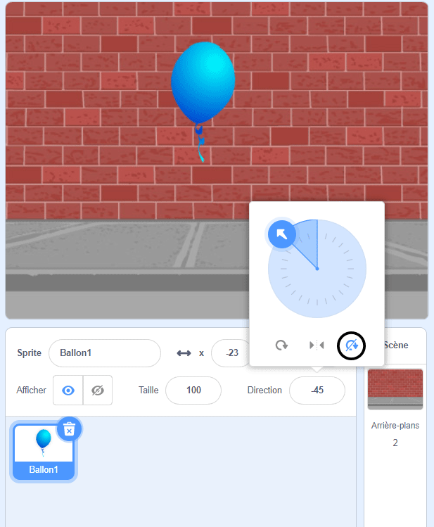

## Animation d'un ballon

--- task ---

Ouvre un nouveau projet Scratch.

**En ligne** : ouvre un [nouveau projet Scratch en ligne](http://rpf.io/scratch-new){:target="_blank"}.

Si tu as un compte Scratch, tu peux en créer une copie en cliquant sur **Remix**.

**Hors-ligne** : ouvre un nouveau projet dans l’éditeur hors-ligne.

Si tu dois télécharger et installer l'éditeur hors-ligne Scratch, tu peux le trouver à [rpf.io/scratchoff](http://rpf.io/scratchoff){:target="_blank"}.

--- /task ---

--- task ---

Supprime le sprite de chat.

--- /task ---

--- task ---

Ajoute un nouveau sprite de ballon et un arrière-plan approprié.


--- /task ---


--- task ---

Ajoute ce code à ton ballon, pour qu'il rebondisse sur l'écran :


```blocks3
    when flag clicked
    go to x:(0) y:(0)
    point in direction (45 v)
    forever
        move (1) steps
        if on edge, bounce
    end
```

--- /task ---

--- task ---

Teste ton ballon. Se déplace-t-il trop lentement ? Modifie les nombres dans ton code si tu souhaites l'accélérer un peu.

--- /task ---

--- task ---

As-tu également remarqué que ton ballon se retourne en se déplaçant sur l'écran ?


Les ballons ne bougent pas comme ça ! Pour résoudre ce problème, clique sur l'icône de sprite de ballon, puis clique sur la direction.

Dans la section « style de rotation », clique sur « Ne pivote pas » pour arrêter la rotation du ballon.



--- /task ---

--- task ---

Teste à nouveau ton programme pour voir si le problème est résolu.

--- /task ---
