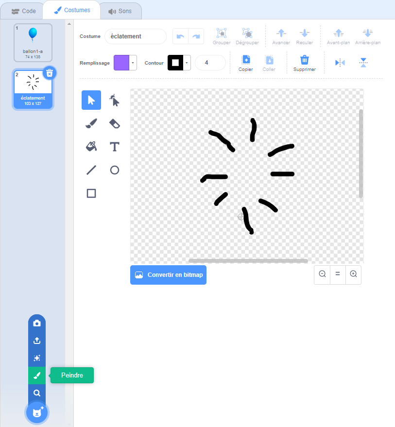

## Ballons à éclater

Permets au joueur de faire éclater les ballons !

--- task ---

Clique sur ton sprite de ballon, puis clique sur l'onglet **Costumes**. Tu peux supprimer tous les autres costumes, en laissant seulement 1 costume de ballon. Ajoute un nouveau costume, en cliquant sur **Peindre** et crée un nouveau costume appelé `éclatement`.



--- /task ---

--- task ---

Assure-toi que ton ballon passe au bon costume au début du jeu. Ton code devrait maintenant ressembler à ceci :


```blocks3
when flag clicked
+switch costume to (balloon1-a v)
point in direction (pick random (-90) to (180))
go to x:(pick random (-150) to (150)) y:(pick random (-150) to (150))
change [color v] effect by (pick random (0) to (200))
forever
    move (1) steps
    if on edge, bounce
end
```

--- /task ---

--- task ---

Pour permettre au joueur d'éclater un ballon, ajoute ce code :


```blocks3
    when this sprite clicked
    switch costume to (éclatement v)
    start sound (pop v)
```

--- /task ---

--- task ---

Teste ton projet. Peux-tu faire éclater le ballon ? Cela fonctionne-t-il comme prévu ?

Tu devras améliorer ce code, de sorte que lorsque le ballon est cliqué, il affiche le costume `éclatement` pendant une courte période, puis est caché.

Tu peux faire tout cela en changeant le code de ton ballon `quand ce sprite est cliqué`{:class="block3events"} comme ceci :


```blocks3
when this sprite clicked
switch costume to (éclatement v)
start sound (pop v)
+ wait (0.3) seconds
+ hide
```

--- /task ---

--- task ---

Maintenant que tu supprimes le ballon quand il est cliqué, tu devras également ajouter un bloc `montrer`{:class="block3looks"} au début du code `quand le drapeau est cliqué`{:class="block3events"}.


```blocks3
when flag clicked
+ show
switch costume to (balloon1-a v)
point in direction (pick random (-90) to (180))
```

--- /task ---

--- task ---

Essaie à nouveau de faire éclater un ballon pour vérifier que cela fonctionne correctement.

--- /task ---
