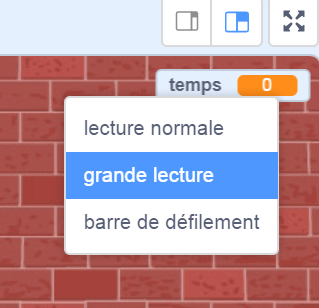

## Ajouter un chronomètre

Tu peux rendre ton jeu plus intéressant, en ne donnant à ton joueur que 10 secondes pour faire éclater autant de ballons que possible.

--- task ---

Tu peux utiliser une autre variable pour stocker le temps restant. Clique sur la scène et crée une nouvelle variable appelée `temps`{:class="block3variables"}.

--- /task ---

Voici comment le chronomètre devrait fonctionner :

+ Le chronomètre devrait démarrer à 10 secondes ;
+ Le chronomètre doit décompter chaque seconde ;
+ Le jeu devrait s'arrêter lorsque le chronomètre atteint 0.

--- task ---

Voici le code pour faire cela, que tu peux ajouter à ta _scène_ :


```blocks3
when flag clicked
set [time v] to [10]
repeat until <(time) = [0]>
    wait (1) seconds
    change [time v] by (-1)
end
stop [all v]
```

--- /task ---

--- task ---

Fais glisser ton affichage de la variable « temps » vers le côté droit de la scène. Tu peux également cliquer avec le bouton droit de la souris sur l'affichage de la variable et choisir « grande lecture » pour changer la façon dont le temps est affiché.



--- /task ---

--- task ---

Teste ton jeu. Combien de points peux-tu marquer ? Si ton jeu est trop facile, tu peux :

+ Donner au joueur moins de temps ;
+ Avoir plus de ballons ;
+ Faire bouger les ballons plus rapidement ;
+ Rendre les ballons plus petits.

Joue à ton jeu plusieurs fois jusqu'à ce que tu sois satisfait du bon niveau de difficulté.

--- /task ---

