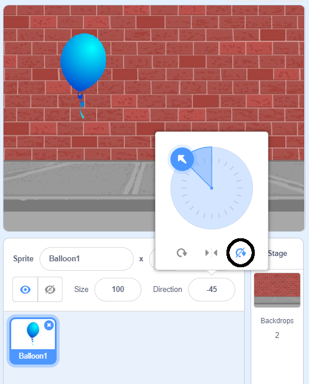

## गुब्बारे को एनिमेट (animate) करना

--- task ---

एक नया Scratch प्रोजेक्ट खोलिये।

**ऑनलाइन**: [नया ऑनलाइन Scratch प्रोजेक्ट](http://rpf.io/scratch-new){:target="_blank"} खोलें |

यदि आपके पास एक Scratch खाता (account) है तो आप **Remix** पर क्लिक करके प्रतिलिपि (copy) बना सकते हैं |

**ऑफ़लाइन**: ऑफलाइन एडिटर (offline editor) में एक नया प्रोजेक्ट खोलें |

यदि आपको Scratch ऑफ़लाइन एडिटर (offline editor) को डाउनलोड और इंस्टॉल (download and install) करना है तो आप इसे [rpf.io/scratchoff](http://rpf.io/scratchoff) {:target="_blank"} पर जाकर कर सकते हैं।

--- /task ---

--- task ---

बिल्ली स्प्राइट को हटा (delete) दें।

--- /task ---

--- task ---

एक नया गुब्बारा स्प्राइट (sprite) और एक उचित स्टेज बैकड्रॉप (stage backdrop) जोड़ें।


--- /task ---


--- task ---

इस कोड को अपने गुब्बारे में जोड़ें ताकि यह स्क्रीन के चारों ओर उछले:


```blocks3
    when flag clicked
    go to x:(0) y:(0)
    point in direction (45 v)
    forever
        move (1) steps
        if on edge, bounce
    end
```

--- /task ---

--- task ---

अपने गुब्बारे का परीक्षण करें। क्या यह बहुत धीरे-धीरे चल रही हैं? यदि आप इसे थोड़ा जल्दी चलाना है तो अपने कोड में संख्याओं को बदल सकते है।

--- /task ---

--- task ---

क्या आपने यह भी देखा कि आपका गुब्बारा पलटी मारता है जब वह स्क्रीन के चारों ओर घूमता है?


गुब्बारे इस तरह तो नहीं चलते हैं! इसे ठीक करने के लिए, गुब्बारा स्प्राइट आइकन (icon) पर क्लिक करें और फिर दिशा (direction) पर क्लिक करें।

आप 'rotation style' भाग में 'Do not rotate' पर क्लिक करें ताकि गुब्बारे घूमना बंद करदें |



--- /task ---

--- task ---

यह देखने के लिए कि क्या समस्या ठीक हो गई है की नहीं, अपने प्रोग्राम को फिर से परिक्षण करें।

--- /task ---
