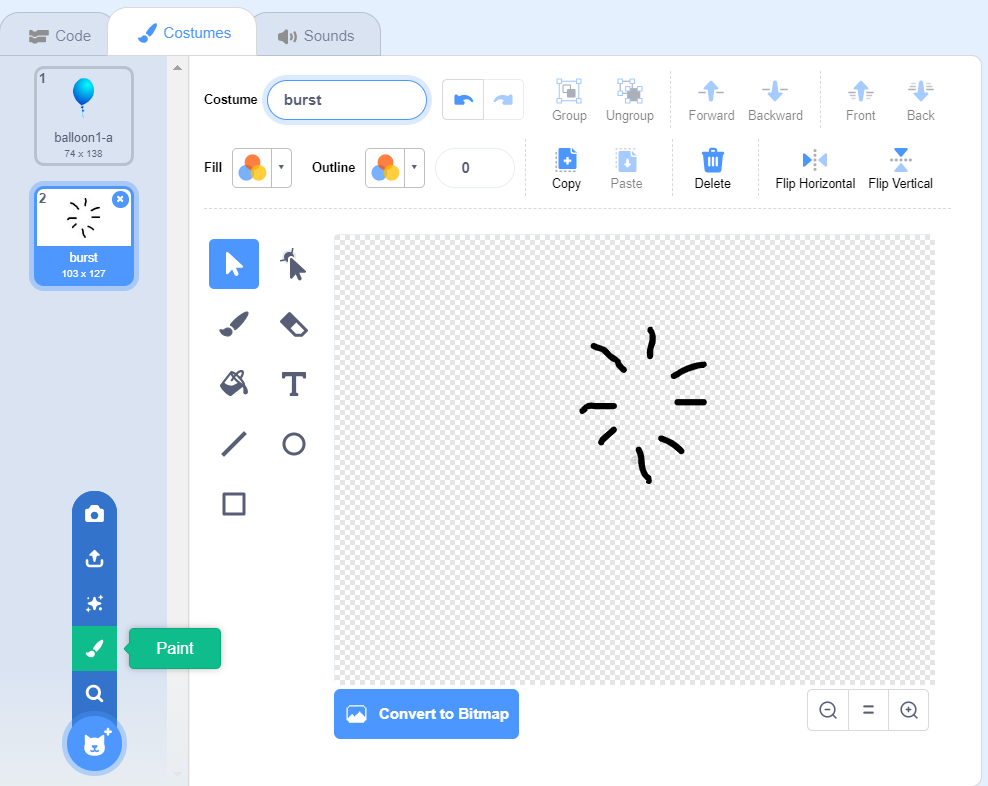

## गुब्बारे फोड़ना

आइये खिलाड़ी को गुब्बारे फोड़ने को अनुमति दें!

--- task ---

अपने गुब्बारे स्प्राइट पर क्लिक करें और फिर **Costumes** बटन पर क्लिक करें । आप अन्य सभी वेशभूषा (costumes) को हटा सकते हैं, बस 1 गुब्बारे का पोशाक को छोड़कर। एक नई पोशाक (costume) जोड़ने के लिए, **Paint a new costume** और `burst` नामक एक नई पोशाक बनाएँ |



--- /task ---

--- task ---

सुनिश्चित करें कि आपका गुब्बारा खेल शुरू होने पर सही पोशाक में बदल जाए। आपका कोड अब इस प्रकार दिखना चाहिए:


```blocks3
when flag clicked
+switch costume to (balloon1-a v)
point in direction (pick random (-90) to (180))
go to x:(pick random (-150) to (150)) y:(pick random (-150) to (150))
change [color v] effect by (pick random (0) to (200))
forever
    move (1) steps
    if on edge, bounce
end
```

--- /task ---

--- task ---

खिलाड़ी को गुब्बारा फोड़ने की अनुमति देने के लिए इस कोड को जोड़ें:


```blocks3
    when this sprite clicked
    switch costume to (burst v)
    start sound (pop v)
```

--- /task ---

--- task ---

अपने प्रोजेक्ट का परीक्षण करें। क्या आप गुब्बारे को फोड़ पा रहे हैं? क्या यह वैसे ही चला जैसा आपने सोचा था?

आपको इस कोड को सुधारना होगा ताकि जब गुब्बारे पर क्लिक किया जाए, तो यह `burst` पोशाक थोड़े समय के लिए दिखाए और फिर छुप जाए |

आप यह सब कर सकते है अगर आप अपने गुब्बारे `when sprite clicked`{:class="block3events"} कोड में यह बदलाव करें:


```blocks3
when this sprite clicked
switch costume to (burst v)
start sound (pop v)
+ wait (0.3) seconds
+ hide
```

--- /task ---

--- task ---

अब जब आप गुब्बारा हटा (delete) रहे हैं जब यह क्लिक किया जाता है, तो आपको एक `show`{:class="block3looks"} ब्लॉक `when flag clicked`{:class="block3events"} कोडके शुरुआत में जोड़ने की ज़रूरत पड़ेगी |


```blocks3
when flag clicked
+ show
switch costume to (balloon1-a v)
point in direction (pick random (-90) to (180))
```

--- /task ---

--- task ---

एक गुब्बारे को फिर से फोड़ने की कोशिश करें, यह जांचने के लिए कि यह ठीक से काम करता है की नही।

--- /task ---
