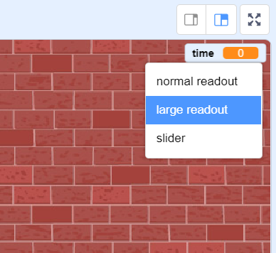

## टाइमर (timer) जोड़ना

आप अपने गेम को और अधिक रोचक बना सकते हैं, जिसमें आप अपने खिलाड़ी को सिर्फ 10 ही सेकण्ड्स (seconds) दें और उसमें वजितने गुब्बारे फोड़ पाए!

--- task ---

बचे हुए समय को संग्रहित (store) करने के लिए आप एक दूसरा वेरिएबल (variable) उपयोग भी कर सकते हैं। `time`{:class="block3variables"} नामक एक नया वेरिएबल (variable) बनाएँ।

--- /task ---

ये टाइमर इस प्रकार काम करना चाहिए:

+ टाइमर 10 सेकंड (second) से शुरू होना चाहिए;
+ टाइमर को हर एक सेकंड गिनना जाना चाहिए;
+ जब टाइमर 0 हो जाए तो गेम को रुक जाना चाहिए।

--- task ---

यहां ऐसा करने के लिए कोड है, जिसे आप अपने _stage_ में जोड़ सकते हैं:


```blocks3
when flag clicked
set [time v] to [10]
repeat until <(time) = [0]>
    wait (1) seconds
    change [time v] by (-1)
end
stop [all v]
```

--- /task ---

--- task ---

अपने 'time' वेरिएबल प्रदर्शन को मंच (stage) के दाईं ओर खींचें। आप वेरिएबल प्रदर्शन पर राइट-क्लिक (right-click) भी कर सकते हैं और समय को प्रदर्शित करने के तरीके को बदलने के लिए 'large readout' को चुन सकते हैं।



--- /task ---

--- task ---

अपने गेम का परीक्षण करें। आप कितने अंक स्कोर कर सकते हैं? यदि आपका गेम बहुत आसान है, तो आप यह कर सकते हैं:

+ खिलाड़ी को कम समय दें सकते है;
+ और बहुत सारे गुब्बारे ला सकते हैं;
+ गुबारों को और भी तेज़ी से घुमाएं;
+ गुब्बारे छोटे करें।

गेम में तब तक परिवर्तन करें और परीक्षण करें जब तक आप इसकी कठिनता के स्तर से ख़ुश न हो जाएँ।

--- /task ---

