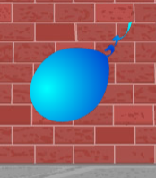

## Animare un palloncino

--- task ---

Inizia un nuovo progetto Scratch.

**Online**: crea un [nuovo progetto Scratch online](http://rpf.io/scratch-new){:target="_blank"}.

Se hai un account su Scratch, puoi farne una copia cliccando su **Remix**.

**Offline**: apri un nuovo progetto nell'editor offline.

Se hai bisogno di scaricare ed installare l'editor offline di Scratch, puoi trovarlo su [rpf.io/scratchoff](http://rpf.io/scratchoff){:target="_blank"}.

--- /task ---

--- task ---

Cancella lo sprite del gatto.

--- /task ---

--- task ---

Aggiungi uno sprite palloncino e uno sfondo adatto.


--- /task ---


--- task ---

Aggiungi questo codice al tuo palloncino per farlo rimbalzare sullo schermo:


```blocks3
    when flag clicked
    go to x:(0) y:(0)
    point in direction (45 v)
    forever
        move (1) steps
        if on edge, bounce
    end
```

--- /task ---

--- task ---

Prova il tuo palloncino. Si muove troppo lentamente? Cambia i numeri nel tuo codice se vuoi velocizzarlo un po'.

--- /task ---

--- task ---

Hai notato che il tuo palloncino si ribalta mentre si muove sullo schermo?



I palloncini non si muovono così! Per risolvere questo problema, fai clic sull'icona dello sprite del palloncino, una volta fatto, fai clic sulla direzione.

Nella sezione "Stile di rotazione", fai clic su "Non ruotare" per non farlo ruotare.


--- /task ---

--- task ---

Prova di nuovo il tuo programma per controllare se il problema è stato risolto.

--- /task ---
