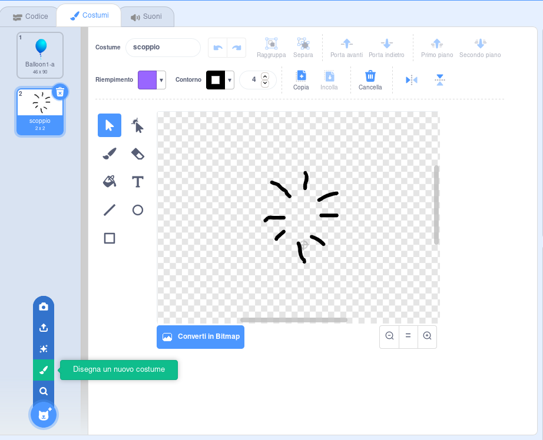

## Palloncini scoppiettanti

Permettiamo a un giocatore di far scoppiare i palloncini!

--- task ---

Fai clic sullo sprite palloncino e poi clicca sulla scheda **Costumi**. Elimina tutti i costumi del palloncino tranne uno. Aggiungi un nuovo costume, facendo clic su **Disegna un nuovo costume** e crea un nuovo costume chiamato `scoppio`.



--- /task ---

--- task ---

Assicurati che il tuo palloncino passi al costume giusto all'inizio del gioco. Il tuo codice dovrebbe apparire così:


```blocks3
when flag clicked
+switch costume to (balloon1-a v)
point in direction (pick random (-90) to (180))
go to x:(pick random (-150) to (150)) y:(pick random (-150) to (150))
change [color v] effect by (pick random (0) to (200))
forever
    move (1) steps
    if on edge, bounce
end
```

--- /task ---

--- task ---

Per far scoppiare un palloncino al giocatore, aggiungi questo codice:


```blocks3
    when this sprite clicked
    switch costume to (scoppio v)
    start sound (pop v)
```

--- /task ---

--- task ---

Prova il tuo progetto. Riesci a far scoppiare il palloncino? Funziona come ti aspettavi?

Dovrai migliorare il codice facendo in modo che, quando si fa clic sul palloncino, questo mostri brevemente il costume `scoppio` e dopo si nasconda.

Puoi riuscirci modificando in questo modo il blocco di codice `quando si clicca su questo sprite`{:class="block3events"} del palloncino:


```blocks3
when this sprite clicked
switch costume to (scoppio v)
start sound (pop v)
+ wait (0.3) seconds
+ hide
```

--- /task ---

--- task ---

Ora che stai nascondendo il palloncino quando viene cliccato, dovrai anche aggiungere un blocco `mostra`{:class="block3looks"} all'inizio del blocco di codice `quando si clicca su bandiera`{:class="block3events"}.


```blocks3
when flag clicked
+ show
switch costume to (balloon1-a v)
point in direction (pick random (-90) to (180))
```

--- /task ---

--- task ---

Prova a far scoppiare un'altra volta un palloncino per controllare che funzioni.

--- /task ---
