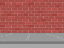

## Aggiungere un cronometro

You can make your game more interesting, by only giving your player 10 seconds to pop as many balloons as possible.

--- task ---

Puoi usare un'altra variabile per tenere il tempo rimanente. Seleziona lo sfondo, e crea un nuova variabile chiamata `tempo`{:class="block3variables"}.

--- /task ---

Ecco come dovrebbe funzionare il cronometro:

+ Dovrebbe iniziare a 10 secondi;
+ Ogni secondo dovrebbe diminuire il tempo rimasto;
+ Il gioco dovrebbe interrompersi quando il cronometro raggiunge lo 0.

--- task ---

Questo è il codice per farlo, che puoi aggiungere allo _sfondo_:



```blocks3
when flag clicked
set [time v] to [10]
repeat until <(time) = [0]>
    wait (1) seconds
    change [time v] by (-1)
end
stop [all v]
```

--- /task ---

--- task ---

Trascina la visualizzazione della variabile "tempo" sul lato destro dello stage. Puoi fare clic con il tasto destro del mouse sul segnaposto della variabile e scegliere "grande" per cambiarne la visualizzazione.


--- /task ---

--- task ---

Prova il tuo codice. Quanti punti riesci a fare? Se il gioco è troppo facile, puoi:

+ Dare al giocatore meno tempo;
+ Creare più palloncini;
+ Far muovere i palloncini più velocemente;
+ Rimpicciolire i palloncini.

Gioca più volte fino a quando non sarai soddisfatto ed avrai trovato il giusto livello di difficoltà.

--- /task ---

