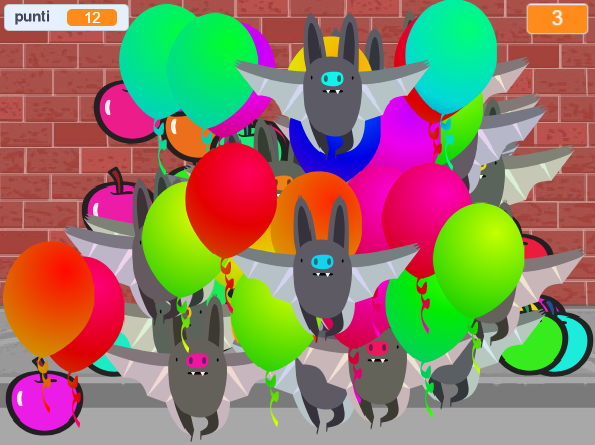

## Sfida: Altri oggetti
Puoi aggiungere altri oggetti al tuo gioco? Puoi aggiungere oggetti buoni, come le ciambelle, che danno molti punti o oggetti cattivi, come i pipistrelli, che tolgono punti.

Pensa agli oggetti che aggiungerai. Pensa a:

+ Quanti ce ne saranno?
+ How big is it? How does it move?
+ How many points will you score (or lose) for clicking it?
+ Will it move faster or slower than the balloons?
+ What will it look/sound like when it's been clicked?

Se hai bisogno di aiuto per aggiungere un altro oggetto, puoi riutilizzare i passaggi precedenti!

