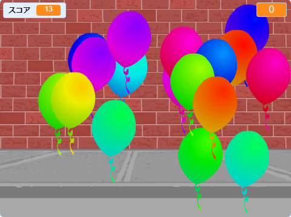

--- no-print ---

これはプロジェクトの**Scratch 3**バージョンです。 [Scratch 2バージョンのプロジェクト](https://projects.raspberrypi.org/en/projects/balloons-scratch2)もあります。

--- /no-print ---

## はじめに

風船を割るゲームを作りましょう！

### 作るもの

--- no-print ---

風船をクリックして割っていきます。

  <iframe allowtransparency="true" width="485" height="402" src="https://scratch.mit.edu/projects/embed/299206746/?autostart=false" frameborder="0" scrolling="no"></iframe>
  

--- /no-print ---

--- print-only ---

--- /print-only ---

--- collapse ---
---
title: 必要（ひつよう）なもの
---

### ハードウェア

+ Scratchを実行できるコンピュータ

### ソフトウェア

+ Scratch 3（[オンライン](http://rpf.io/scratchon){:target="_blank"}または[オフライン](http://rpf.io/scratchoff){:target="_blank"}）

--- /collapse ---

--- collapse ---
---
title: 学ぶこと
---

- アニメーションを使用してスプライトを動かす方法
- 乱数（らんすう）の使い方
- スプライトの描き方
- スプライトのクローンを作成する方法

--- /collapse ---

--- collapse ---
---
title: 教育者向けの追加情報
---

--- no-print ---

このプロジェクトを印刷する必要がある場合は、[印刷用バージョン](https://projects.raspberrypi.org/en/projects/balloons/print){:target="_ blank"}を使用してください。

--- /no-print ---

[完成したプロジェクトはこちらに](http://rpf.io/p/en/balloons-get){:target="_blank"}あります 。

--- /collapse ---
