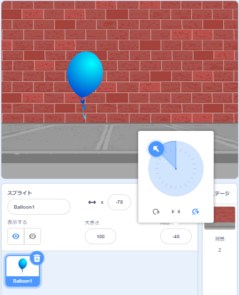

## 風船に動きをつける

--- task ---

新しいScratchプロジェクトを開きます。

**オンライン**：[新しいオンラインScratchプロジェクト](http://rpf.io/scratch-new){:target="_ blank"}を開きます。

Scratchアカウントをお持ちの場合は**リミックス**をクリックしてコピーを作成できます。

**オフライン**：オフラインエディタで新しいプロジェクトを開きます。

[rpf.io/scratchoff](http://rpf.io/scratchoff){:target="_blank"}からScratchオフラインエディタをダウンロードしてインストールできます。

--- /task ---

--- task ---

猫のスプライトを削除します。

--- /task ---

--- task ---

新しい風船のスプライトと、ふさわしいステージの背景（はいけい）を追加します。


--- /task ---


--- task ---

このコードを風船に追加して、画面の端で跳ね返るようにします：


```blocks3
    when flag clicked
    go to x:(0) y:(0)
    point in direction (45 v)
    forever
        move (1) steps
        if on edge, bounce
    end
```

--- /task ---

--- /task ---

風船の動きを確認しましょう。 動きが遅すぎませんか？ もう少し速くするには、コードの数値を変更してください。

--- /task ---

--- task ---

画面の端で跳ね返るときに風船がひっくり返ることにも気づきましたか？


風船はこのように動きません！ これを修正するには、風船のスプライトアイコンをクリックして、向きをクリックします。

In the 'rotation style' section, click 'Do not rotate' to stop the balloon rotating.



--- /task ---

--- task ---

Test your program again to see if the problem is fixed.

--- /task ---
