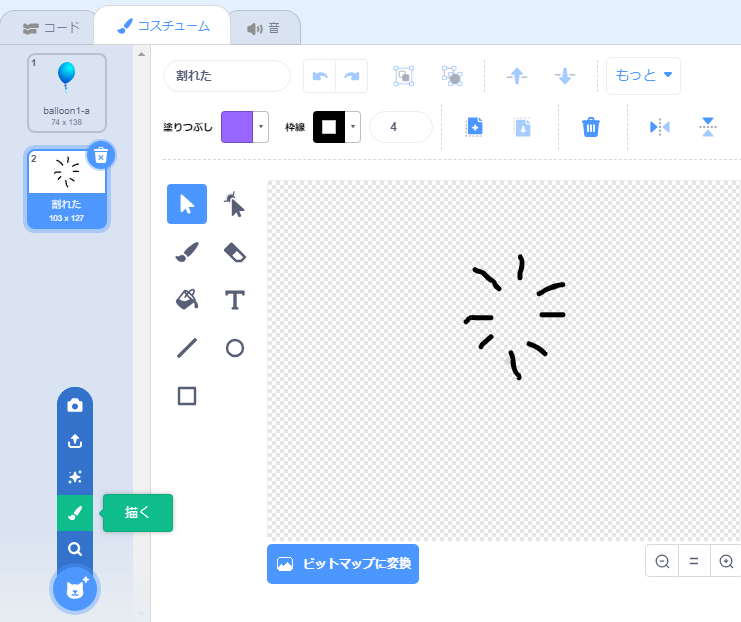

## 風船を割る

プレーヤーが風船を割ることができるようにしましょう！

--- task ---

風船のスプライトをクリックして、**コスチューム**タブをクリックします。 風船のコスチュームを1つだけ残して、他のすべてのコスチュームを削除します。 **描く**をクリックして、新しいコスチュームを追加します。そしてコスチュームの名前を`割れた`にします。



--- /task ---

--- task ---

ゲームの開始時に、風船が正しいコスチュームに切り替わるようにしてください。 コードは以下のようになります：


```blocks3
when flag clicked
+switch costume to (balloon1-a v)
point in direction (pick random (-90) to (180))
go to x:(pick random (-150) to (150)) y:(pick random (-150) to (150))
change [color v] effect by (pick random (0) to (200))
forever
    move (1) steps
    if on edge, bounce
end
```

--- /task ---

--- task ---

プレーヤーが風船を割ることができるようにするには、次のコードを追加します：


```blocks3
    when this sprite clicked
    switch costume to (割れた v)
    start sound (pop v)
```

--- /task ---

--- task ---

プロジェクトをテストします。 風船を割ることができますか？ 期待どおりに動作しますか？

このコードを改善して、風船をクリックしたときに`割れた`コスチュームがしばらくの間表示され、そして消えるようにします。

風船の`スプライトが押されたとき`{:class="block3events"}コードを次のように変更することで、これらすべてを実現できます：


```blocks3
when this sprite clicked
switch costume to (割れた v)
start sound (pop v)
+ wait (0.3) seconds
+ hide
```

--- /task ---

--- task ---

風船をクリックしたときに消すようにしたので、`旗が押されたとき`{:class="block3events"}のコードの先頭に`表示する`{:class="block3looks"}ブロックも追加する必要があります。


```blocks3
when flag clicked
+ show
switch costume to (balloon1-a v)
point in direction (pick random (-90) to (180))
```

--- /task ---

--- task ---

もう一度風船を割ってみて、正しく機能することを確認します。

--- /task ---
