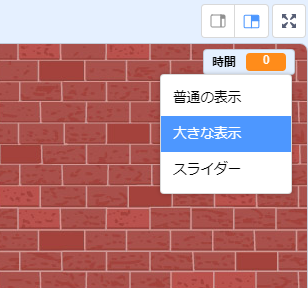

## タイマーの追加

プレーヤーが風船をできるだけ多く割る時間を10秒間だけにすることで、ゲームをより面白くすることができます。

--- task ---

別の変数を使用して、残りの持ち時間を保存します。 ステージをクリックし、`時間`{:class="block3variables"}という新しい変数を作成します。

--- /task ---

タイマーは次のように動作します：

+ タイマーは10秒から始まります。
+ タイマーは1秒ごとにカウントダウンします。
+ タイマーが0になると、ゲームは終わります。

--- task ---

コードはつぎのようになり、_ステージ_に追加します：


```blocks3
when flag clicked
set [time v] to [10]
repeat until <(time) = [0]>
    wait (1) seconds
    change [time v] by (-1)
end
stop [all v]
```

--- /task ---

--- task ---

「時間」変数の表示をステージの右側にドラッグします。 変数の表示を右クリックし、「大きな表示」を選択して、時間の表示方法を変更します。



--- /task ---

--- task ---

ゲームをテストします。 何点取れましたか？ ゲームがかんたんすぎるようでしたら、こんな風にしてみましょう：

+ Give the player less time;
+ Have more balloons;
+ Make the balloons move faster;
+ Make the balloons smaller.

Play your game a few times until you're happy that it's the right level of difficulty.

--- /task ---

