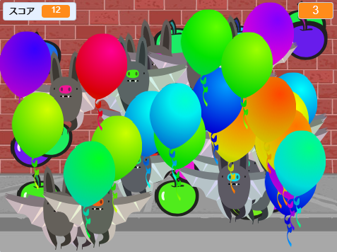

## チャレンジ：物体をふやす
ゲームに他の物体を追加できますか？ ドーナツのように点がたくさんもらえる良い物体、またはコウモリのように点をとられてしまう悪い物体などです。

追加する物体について考える必要があります。 以下について考えましょう：

+ いくつ出るようにしますか？
+ 大きさはどれくらいですか？ どのように動きますか？
+ クリックした時に、何点もらえますか（またはとられますか）？
+ 風船より速く動きますか？遅く動きますか？
+ クリックした時に、どのような見た目になりますか？どんな音が鳴りますか？

別の物体を追加するのに手助けが必要なら、これまでにやった方法を使ってみましょう。

