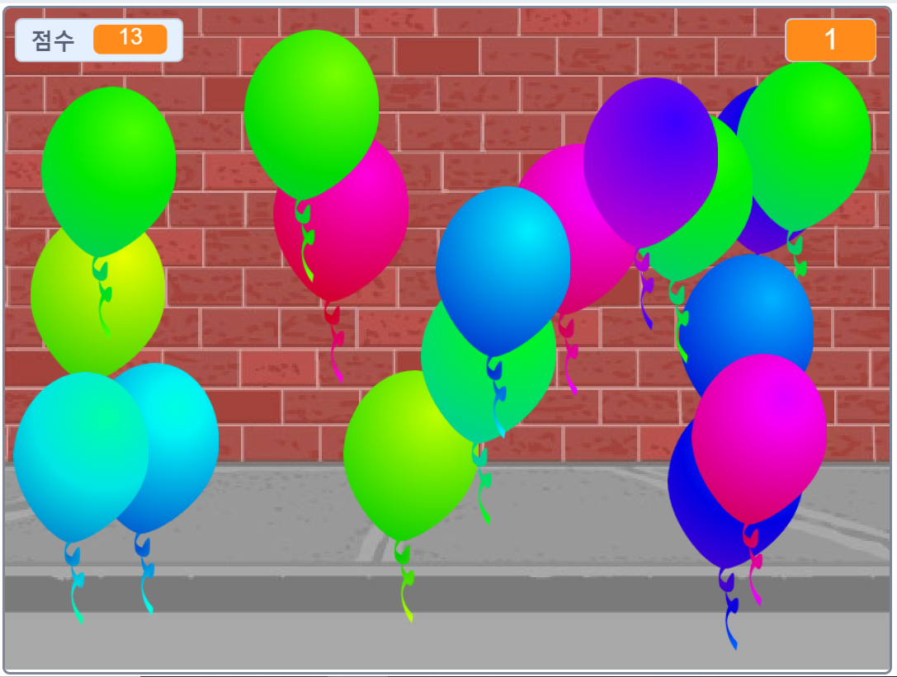

--- no-print ---

이 프로젝트는 **스크래치 3** 버전입니다. [스크래치 2 버전의 프로젝트](https://projects.raspberrypi.org/ko-KR/projects/balloons-scratch2)도 있습니다.

--- /no-print ---

## 소개

당신은 풍선 터뜨리기 게임을 만들 것입니다!

### 만들 작품

--- no-print ---

풍선을 클릭하여 터뜨리세요.

  <iframe allowtransparency="true" width="485" height="402" src="https://scratch.mit.edu/projects/embed/392886957/?autostart=false" frameborder="0" scrolling="no"></iframe>
  

--- /no-print ---

--- print-only ---

--- /print-only ---

--- collapse ---
---
title: 준비물
---

### 하드웨어

+ 스크래치를 실행할 수 있는 컴퓨터

### 소프트웨어

+ 스크래치 3 ( [온라인](http://rpf.io/scratchon){:target="_blank"} 또는 [오프라인](http://rpf.io/scratchoff){:target="_blank"})

--- /collapse ---

--- collapse ---
---
title: 배우게 될 것
---

- 스프라이트를 움직이기 위해 동작을 사용하는 방법
- 난수 사용 방법
- 스프라이트를 그리기
- 스프라이트의 복제본을 만들기

--- /collapse ---

--- collapse ---
---
title: 교육자를 위한 추가 정보
---

--- no-print ---

이 프로젝트를 인쇄하려면, [프린트용 버전](https://projects.raspberrypi.org/ko-KR/projects/balloons/print){:target="_blank"}을 사용하십시오.

--- /no-print ---

여기서 [완료된 프로젝트](http://rpf.io/p/ko-KR/balloons-get){:target="_blank"}.를 확인할 수 있습니다.

--- /collapse ---
