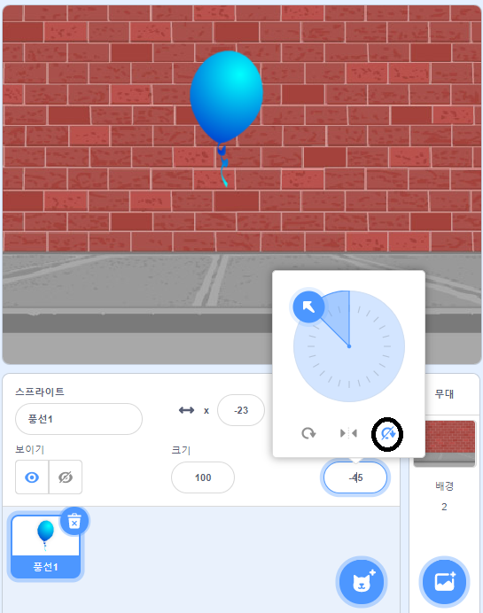

## 풍선을 움직이게 만들기

--- task ---

새 스크래치 프로젝트를 엽니다.

**온라인**: [새로 만들기](http://rpf.io/scratch-new){:target="_blank"}를 클릭합니다.

스크래치 계정이 있는 경우 **리믹스**를 클릭하여 복사본을 만들 수 있습니다.

**오프라인**: 오프라인 편집기에서 새 프로젝트를 엽니다.

스크래치 오프라인 에디터를 설치해야 하는 경우, [rpf.io/scratchoff](http://rpf.io/scratchoff){:target="_blank"}에서 다운로드할 수 있습니다.

--- /task ---

--- task ---

고양이 스프라이트 제거하기

--- /task ---

--- task ---

새로운 풍선 스프라이트와 적절한 무대 배경을 추가하세요.


--- /task ---


--- task ---

이 코드를 풍선에 추가하여, 화면에 튕겨다니도록 만드세요.


```blocks3
    when flag clicked
    go to x:(0) y:(0)
    point in direction (45 v)
    forever
        move (1) steps
        if on edge, bounce
    end
```

--- /task ---

--- task ---

풍선을 테스트해보세요. 천천히 움직이나요? 만약 조금 더 빠르게 만들고 싶다면 코드의 숫자를 바꿔보세요.

--- /task ---

--- task ---

혹시 당신의 풍선이 화면을 움직이면서 홱 뒤집힌다는 것을 알아차렸나요?


풍선은 이런식으로 움직이지 않아요! 이것을 고치기 위해, 풍선의 스프라이트 아이콘을 클릭하세요. 그리고 방향을 클릭해봅시다.

'회전 형태'의 구획에서, '회전하지 않기'를 클릭하여 풍선이 회전하지 않도록 만드세요.



--- /task ---

--- task ---

프로그램을 다시 테스트하여 이 문제가 해결되었는지 보세요.

--- /task ---
