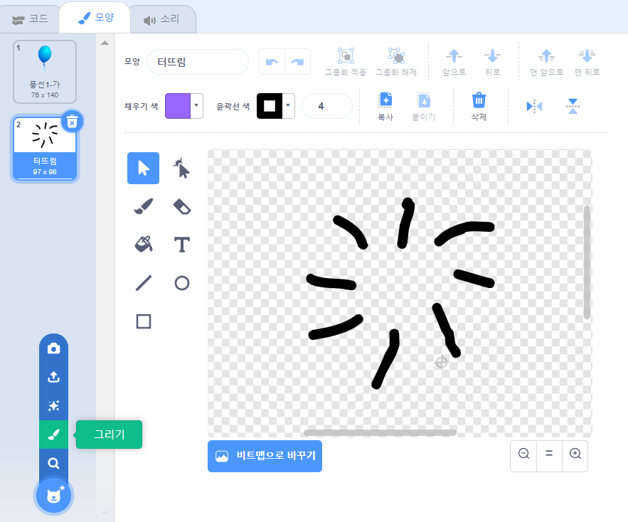

## 풍선 터뜨리기

플레이어가 풍선을 터뜨릴 수 있도록 합시다!

--- task ---

풍선 스프라이트를 클릭한 뒤, **모양** 탭을 클릭합니다. 당신은 풍선1 모양만 남기고, 다른 모든 모양들을 제거할 수 있습니다. **그리기**를 클릭하여 새로운 모양을 추가하세요. 그리고 `터뜨림`이라는 새로운 모양을 만드세요.



--- /task ---

--- task ---

게임이 시작할 때, 풍선이 오른쪽 모양으로 바뀌도록 하는 것을 잊지마세요. 다음과 같은 코드가 될 것입니다:


```blocks3
when flag clicked
+switch costume to (풍선1-가 v)
point in direction (pick random (-90) to (180))
go to x:(pick random (-150) to (150)) y:(pick random (-150) to (150))
change [color v] effect by (pick random (0) to (200))
forever
    move (1) steps
    if on edge, bounce
end
```

--- /task ---

--- task ---

플레이어가 풍선을 터뜨릴 수 있도록, 이 코드를 추가하세요:


```blocks3
    when this sprite clicked
    switch costume to (터뜨림 v)
    start sound (pop v)
```

--- /task ---

--- task ---

프로젝트를 테스트 해 보세요. 풍선을 터뜨릴 수 있나요? 당신이 기대했던 것 처럼 실행되나요?

풍선이 클릭되었을 때, `터뜨림` 모양이 잠깐 나타났다가 보이지 않도록, 이 코드를 발전시켜야 합니다.

풍선의 `이 스프라이트를 클릭했을 때`{:class="block3events"} 코드를 변경함으로써 앞선 모든 것들이 일어나도록 할 수 있습니다. 이렇게요:


```blocks3
when this sprite clicked
switch costume to (터뜨림 v)
start sound (pop v)
+ wait (0.3) seconds
+ hide
```

--- /task ---

--- task ---

이제 풍선을 클릭하면, 이를 제거할 수 있습니다. 또한 `깃발을 클릭했을 때`{:class="block3events"} 코드의 시작점에 `보이기`{:class="block3looks"} 블럭을 추가해야 할 필요가 있을 것입니다.


```blocks3
when flag clicked
+ show
switch costume to (풍선1-가 v)
point in direction (pick random (-90) to (180))
```

--- /task ---

--- task ---

풍선을 터뜨려 코드가 제대로 작동하는지 확인하세요.

--- /task ---
