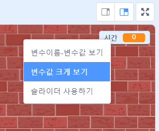

## 타이머 추가하기

플레이어에게 딱 10초 동안 최대한 많은 풍선을 터뜨릴 수 있도록 하여 게임을 더 재미있게 만들 수 있습니다.

--- task ---

당신은 남은 시간을 저장할 다른 변수를 사용할 수 있습니다. 무대를 클릭하고, `시간`{:class="block3variables"}이라는 새로운 변수를 만드세요.

--- /task ---

아래는 타이머가 작동되어야 하는 방식입니다:

+ 타이머는 10초에서 시작해야 합니다.
+ 타이머는 매초마다 1씩 줄어야 합니다.
+ 타이머가 0이 되면 게임이 끝나야 합니다.

--- task ---

이 코드를 _무대_ 에 추가하여 위의 것들을 할 수 있습니다.


```blocks3
when flag clicked
set [time v] to [10]
repeat until <(time) = [0]>
    wait (1) seconds
    change [time v] by (-1)
end
stop [all v]
```

--- /task ---

--- task ---

'시간' 변수의 디스플레이를 무대의 오른쪽에 드래그하세요. 변수의 디스플레이를 우클릭하고 '변수값 크게 보기'를 선택하여 시간이 보여지는 방식을 바꿀 수도 있습니다.



--- /task ---

--- task ---

게임을 테스트해 보세요. 얼마나 많은 점수를 얻을 수 있나요? 만약 게임이 너무 쉽다면 다음과 같이 바꿀 수 있습니다.

+ 플레이어에게 더 적은 시간 주기
+ 더 많은 풍선 넣기
+ 풍선들을 더 빠르게 만들기
+ 풍선들을 더 작게 만들기

난이도가 적당한 수준이라고 만족할 때까지 게임을 몇 번 실행해 보세요.

--- /task ---

