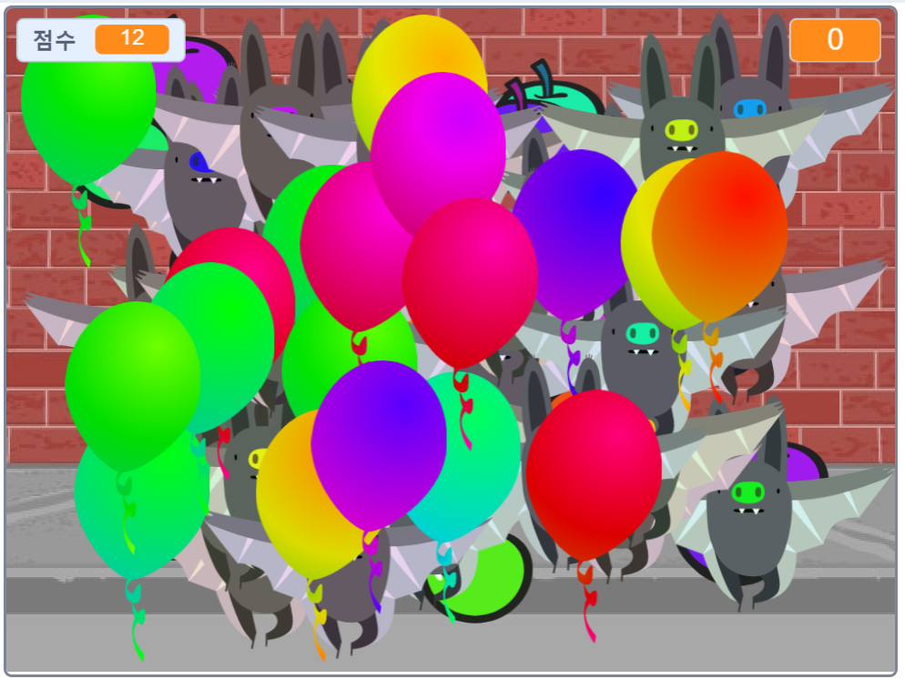

## 과제: 더 많은 물체
다른 물체들을 게임에 추가할 수 있나요? 당신은 많은 점수를 주는 도넛같은 좋은 물체나, 점수를 깎는 박쥐같은 나쁜 물체를 추가할 수 있습니다.

추가할 물체들에 대해 고민해야 합니다. 생각해 보세요:

+ 얼마나 많이 있을 것인가요?
+ 얼마나 큰가요? 어떻게 움직이나요?
+ 클릭하면 얼마나 많은 점수를 얻(잃)나요?
+ 풍선들보다 빠르게 움직이나요, 느리게 움직이나요?
+ 클릭됐을 때 어떤 모양이 되고, 어떤 소리가 나나요?

다른 물체들을 추가하는 데에 도움이 필요하다면, 이전의 과정을 재사용하면 됩니다!

