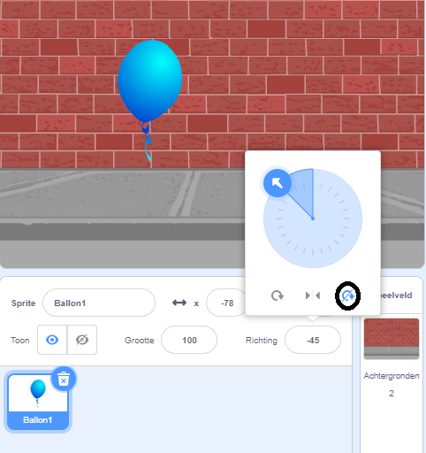

## Een ballon animeren

--- task ---

Open een nieuw Scratch project.

**Online**: open een [nieuw online Scratch-project](http://rpf.io/scratch-new){:target="_blank"}.

Als je een Scratch account hebt, kun je een kopie maken door op **Remix** te klikken.

**Offline:** open een nieuw project in de offline editor.

Als je de Scratch offline editor wilt downloaden en installeren dan kun je die vinden op [rpf.io/scratchoff](http://rpf.io/scratchoff){:target="_blank"}.

--- /task ---

--- task ---

Verwijder de kat sprite.

--- /task ---

--- task ---

Voeg een nieuwe ballonsprite toe en een geschikte speelveld-achtergrond.


--- /task ---


--- task ---

Voeg deze code toe aan je ballon, zodat deze rond het scherm stuitert:


```blocks3
    when flag clicked
    go to x:(0) y:(0)
    point in direction (45 v)
    forever
        move (1) steps
        if on edge, bounce
    end
```

--- /task ---

--- task ---

Test je ballon. Beweegt het te langzaam? Verander de getallen in je code als je deze een beetje wilt versnellen.

--- /task ---

--- task ---

Is het je ook opgevallen dat je ballon omdraait terwijl hij over het scherm beweegt?


Ballonnen bewegen niet zo! Om dit op te lossen, klik je op het pictogram van de ballonsprite en vervolgens op de richting.

Klik in het gedeelte 'rotatiestijl' op 'Niet meedraaien' om het draaien van de ballon te stoppen.



--- /task ---

--- task ---

Test je programma opnieuw om te zien of het probleem is verholpen.

--- /task ---
