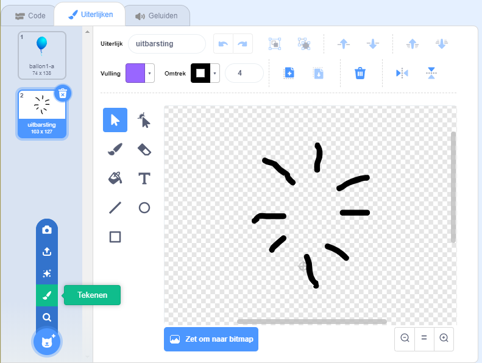

## Ballonnen knallen

Laat de speler de ballonnen laten ploffen!

--- task ---

Klik op je ballonsprite en klik vervolgens op het **Uiterlijken** tabblad. Je kunt alle andere uiterlijken verwijderen, zodat er maar 1 ballonuiterlijk overblijft. Voeg een nieuw uiterlijk toe door te klikken op **Teken nieuw uiterlijk** en maak een nieuw uiterlijk genaamd `uitbarsting`.



--- /task ---

--- task ---

Zorg ervoor dat je ballon bij het begin van het spel naar het juiste uiterlijk schakelt. Je code zou er nu als volgt uit moeten zien:


```blocks3
when flag clicked
+switch costume to (balloon1-a v)
point in direction (pick random (-90) to (180))
go to x:(pick random (-150) to (150)) y:(pick random (-150) to (150))
change [color v] effect by (pick random (0) to (200))
forever
    move (1) steps
    if on edge, bounce
end
```

--- /task ---

--- task ---

Voeg de volgende code toe zodat de speler een ballon kan laten ploffen:


```blocks3
    when this sprite clicked
    switch costume to (uitbarsting v)
    start sound (pop v)
```

--- /task ---

--- task ---

Test je project. Kun je de ballon laten knallen? Werkt het zoals je verwacht?

Je moet deze code verbeteren, zodat wanneer op de ballon wordt geklikt, deze het `uitbarsting` uiterlijk toont gedurende een korte tijd, en dan wordt verborgen.

Je kunt dit allemaal laten gebeuren door je ballon `wanneer op deze sprite wordt geklikt`{:class="block3events"} code te wijzigen in:


```blocks3
when this sprite clicked
switch costume to (uitbarsting v)
start sound (pop v)
+ wait (0.3) seconds
+ hide
```

--- /task ---

--- task ---

Nu je de ballon verwijdert wanneer erop wordt geklikt, moet je ook een `verschijn`{:class="block3looks"} blok toevoegen aan het begin van de `wanneer op de groene vlag wordt geklikt`{:class="block3events"} code.


```blocks3
when flag clicked
+ show
switch costume to (balloon1-a v)
point in direction (pick random (-90) to (180))
```

--- /task ---

--- task ---

Probeer opnieuw een ballon te laten ploffen om te controleren of deze goed werkt.

--- /task ---
