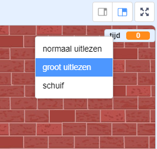

## Een timer toevoegen

Je kunt je spel interessanter maken door je speler slechts 10 seconden de tijd te geven om zoveel mogelijk ballonnen te laten knallen.

--- task ---

Je kunt een andere variabele gebruiken om de resterende tijd op te slaan. Klik op het speelveld en maak een nieuwe variabele met de naam `tijd`{:class="block3variables"}.

--- /task ---

Zo zou de timer moeten werken:

+ De timer moet beginnen op 10 seconden;
+ De timer moet elke seconde aftellen;
+ Het spel zou moeten stoppen als de timer op 0 komt.

--- task ---

Hier is de code om dit te doen, die je aan je _speelveld_ kunt toevoegen:


```blocks3
when flag clicked
set [time v] to [10]
repeat until <(time) = [0]>
    wait (1) seconds
    change [time v] by (-1)
end
stop [all v]
```

--- /task ---

--- task ---

Sleep je 'tijd'-variabele weergave naar de rechterkant van het speelveld. Je kunt ook met de rechtermuisknop op de variabeleweergave klikken en 'groot uitlezen' kiezen om de weergave van de tijd te wijzigen.



--- /task ---

--- task ---

Test je spel. Hoeveel punten kun je scoren? Als je spel te gemakkelijk is, kun je:

+ De speler minder tijd geven;
+ Meer ballonnen hebben;
+ De ballonnen sneller laten bewegen;
+ De ballonnen kleiner maken.

Speel je spel een paar keer totdat je blij bent dat het de juiste moeilijkheidsgraad heeft.

--- /task ---

