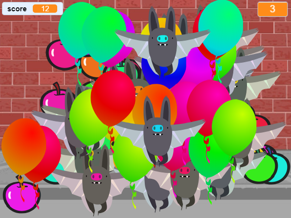

## Uitdaging: meer objecten
Kun je andere objecten aan je spel toevoegen? Je kunt goede objecten toevoegen, zoals donuts, die je veel punten opleveren, of slechte objecten, zoals vleermuizen, die punten wegnemen.

Je moet nadenken over de objecten die je toevoegt. Denk aan:

+ Hoeveel zullen er zijn?
+ Hoe groot is het? Hoe beweegt het?
+ Hoeveel punten scoor (of verlies je) als je erop klikt?
+ Gaat het sneller of langzamer dan de ballonnen?
+ Hoe ziet het eruit en klinkt het wanneer erop wordt geklikt?

Als je hulp nodig hebt bij het toevoegen van een ander object, kun je de vorige stappen hergebruiken!

