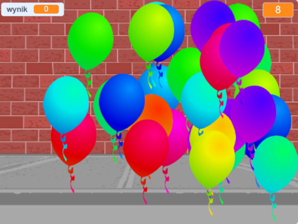

--- no-print ---

To jest wersja projektu korzystająca z **Scratch 3**. Istnieje również [wersja tego projektu dla Scratch 2](https://projects.raspberrypi.org/pl-PL/projects/balloons-scratch2).

--- /no-print ---

## Wprowadzenie

Naucz się, jak stworzyć grę, w której przebijasz balony!

### Co stworzysz

--- no-print ---

Przebijaj balony klikając na nie.

  <iframe allowtransparency="true" width="485" height="402" src="https://scratch.mit.edu/projects/embed/438066327/?autostart=false" frameborder="0" scrolling="no"></iframe>
  

--- /no-print ---

--- print-only ---

--- /print-only ---

--- collapse ---
---
title: Czego będziesz potrzebować
---

### Sprzęt

+ Komputer, na którym można uruchomić Scratch

### Oprogramowanie

+ Scratch 3 ([online](https://rpf.io/scratchon){:target="_blank"} lub [offline](https://rpf.io/scratchoff){:target="_blank"})

--- /collapse ---

--- collapse ---
---
title: Czego się nauczysz
---

- Jak używać animacji do poruszania duszków
- Jak korzystać z liczb losowych
- Jak rysować duszki
- Jak stworzyć klony duszka

--- /collapse ---

--- collapse ---
---
title: Dodatkowe informacje dla nauczycieli
---

--- no-print ---

Jeśli chcesz wydrukować ten projekt, użyj [wersji do druku](https://projects.raspberrypi.org/pl-PL/projects/balloons/print){:target="_blank"}.

--- /no-print ---

Możesz znaleźć [ukończoną wersję projektu tutaj](https://rpf.io/p/pl-PL/balloons-get){:target="_blank"}.

--- /collapse ---
