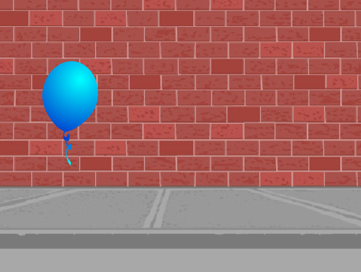

## Animowanie balonu

--- task ---

Otwórz nowy projekt Scratch.

**Online**: otwórz [projekt początkowy](http://rpf.io/scratch-new){:target="_ blank"}.

Jeśli masz konto Scratch, możesz wykonać kopię klikając **Remiks**.

**Offline**: otwórz nowy projekt w edytorze offline.

Jeśli musisz pobrać i zainstalować edytor Scratcha, znajdziesz go na stronie [rpf.io/scratchoff](http://rpf.io/scratchoff){:target="_blank"}.

--- /task ---

--- task ---

Usuń duszka kota.

--- /task ---

--- task ---

Dodaj nowego duszka balonu i odpowiednie tło sceny.



--- /task ---


--- task ---

Dodaj ten kod do balonu, aby odbijał się po ekranie:


```blocks3
    when flag clicked
    go to x:(0) y:(0)
    point in direction (45 v)
    forever
        move (1) steps
        if on edge, bounce
    end
```

--- /task ---

--- task ---

Przetestuj swój kod. Czy porusza się zbyt wolno? Zmień liczby w kodzie, jeśli chcesz go trochę przyspieszyć.

--- /task ---

--- task ---

Czy zauważyłeś również, że twój balon obraca się podczas poruszania się po ekranie?


Balony nie poruszają się w ten sposób! Aby to naprawić, kliknij ikonę duszka balonowego, a następnie kliknij kierunek.

W sekcji „styl obrotu” kliknij „nie obracaj”, aby zatrzymać obracanie balonu.


--- /task ---

--- task ---

Przetestuj swój program ponownie, aby sprawdzić, czy problem został rozwiązany.

--- /task ---
