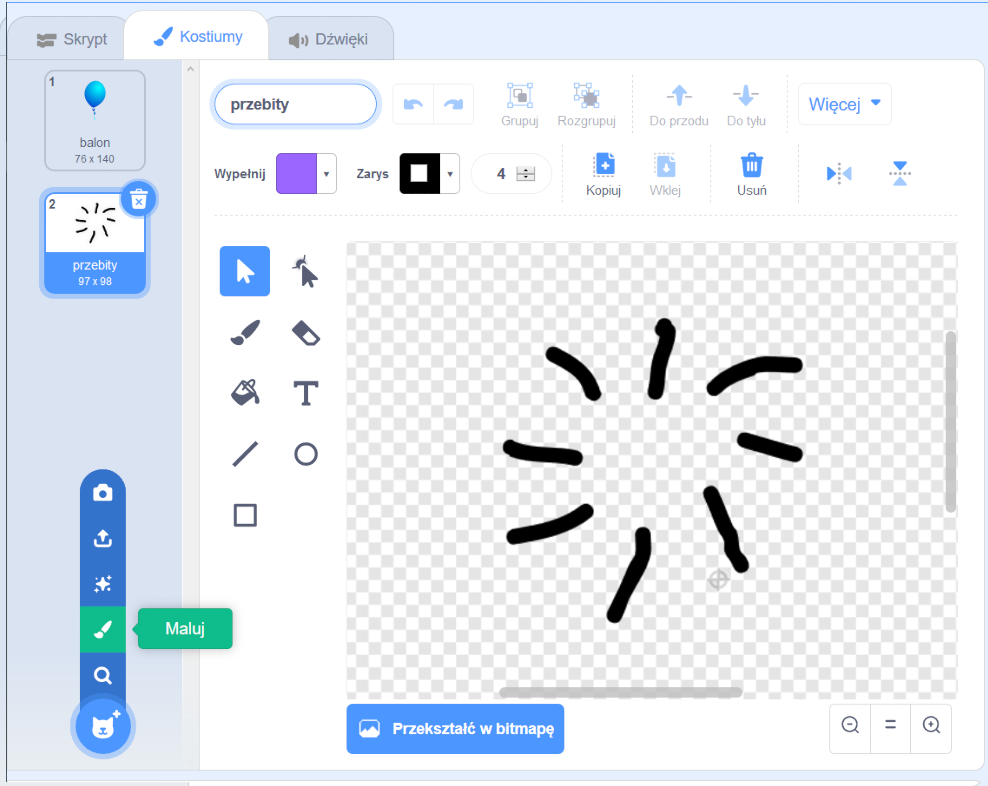

## Przebijanie balonów

Pozwólmy graczowi przebijać balony!

--- task ---

Kliknij duszka balonu, a następnie kliknij na zakładkę **Kostiumy**. Możesz usunąć wszystkie pozostałe kostiumy, pozostawiając tylko jeden kostium balonu. Dodaj nowy kostium, klikając **Maluj** i stwórz nowy kostium o nazwie `przebity`.



--- /task ---

--- task ---

Upewnij się, że twój balon przełączy się na odpowiedni kostium na początku gry. Twój kod powinien wyglądać tak:


```blocks3
when flag clicked
+switch costume to (balon v)
point in direction (pick random (-90) to (180))
go to x:(pick random (-150) to (150)) y:(pick random (-150) to (150))
change [color v] effect by (pick random (0) to (200))
forever
    move (1) steps
    if on edge, bounce
end
```

--- /task ---

--- task ---

Aby umożliwić graczowi przebijanie balonu, dodaj ten kod:


```blocks3
    when this sprite clicked
    switch costume to (przebity v)
    start sound (pop v)
```

--- /task ---

--- task ---

Przetestuj swój projekt. Czy potrafisz przebić balon? Czy działa to tak jak się spodziewałaś?

Musisz poprawić ten kod, aby po kliknięciu balonu, na krótki czas wyświetlał się `przebity` kostium, a następnie był ukryty.

Możesz to wszystko zrobić, zmieniając balon `kiedy ten duszek kliknięty`{:class="block3events"} kod do tego:


```blocks3
when this sprite clicked
switch costume to (przebity v)
start sound (pop v)
+ wait (0.3) seconds
+ hide
```

--- /task ---

--- task ---

Teraz, gdy usuwasz balon po jego kliknięciu, musisz również dodać blok `pokaż`{:class="block3looks"} do początku kodu `kiedy kliknięto zieloną flagę`{:class="block3events"}.


```blocks3
when flag clicked
+ show
switch costume to (balon v)
point in direction (pick random (-90) to (180))
```

--- /task ---

--- task ---

Spróbuj ponownie przebić balon, aby sprawdzić, czy działa poprawnie.

--- /task ---
